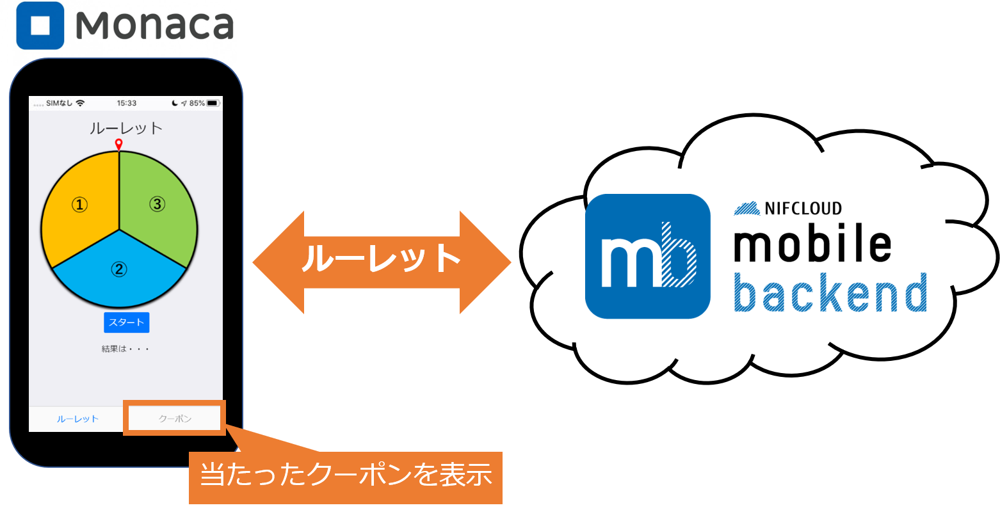
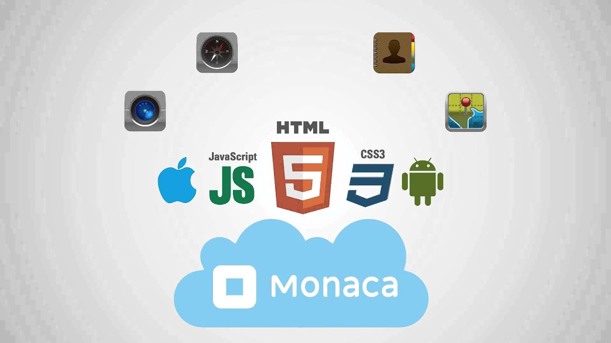
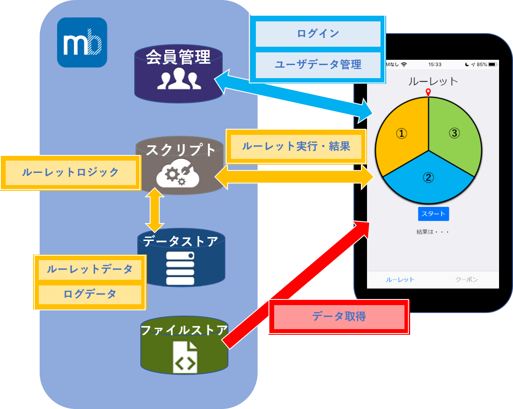
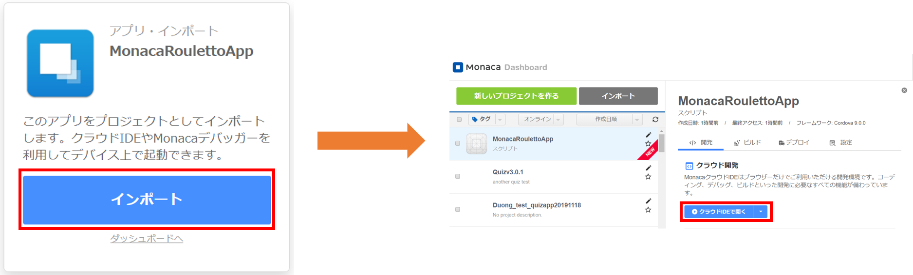
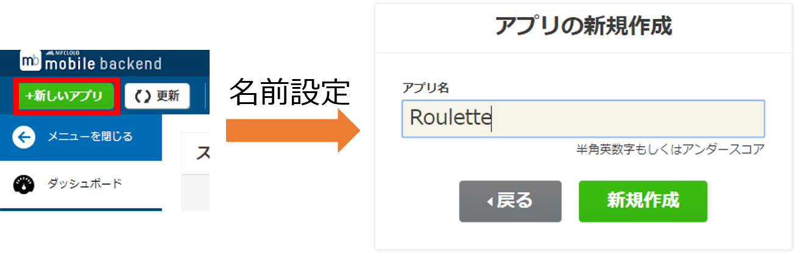
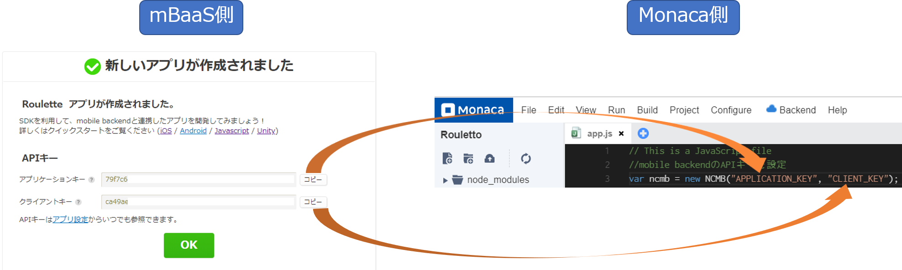
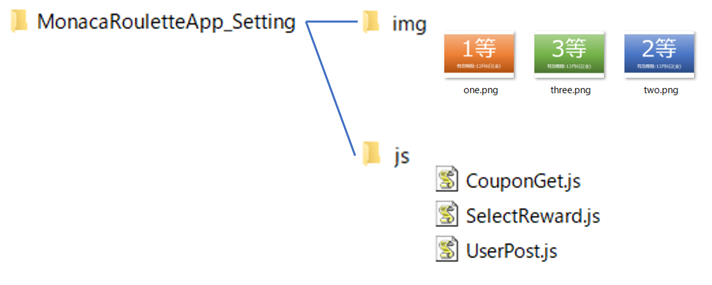
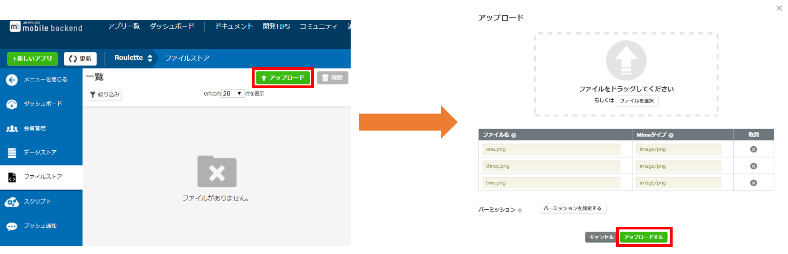

name: inverse
layout: true
class: center, middle, inverse

---
# 【Unityハンズオン】
# サーバーレスでルーレットアプリに クーポン機能を実装してみよう！

@ 富士通クラウドテクノロジーズ 株式会社

.footnote[
 20191119作成
]
---
layout: true
class: center, middle, inverse
---
# 今回作成するアプリについて

---
layout: false

### 概要
* ニフクラ mobile backendの『スクリプト機能』を利用して 
__`サーバーレスでルーレットアプリにクーポン機能を実装します`__
* サーバーレスとは?  __`サーバーを用意する必要なく`__ 、アプリ機能を作成できるということです

.center[]

---
layout: true
class: center, middle, inverse
---
# アプリを作るために使うツール

---
layout: false

### [Monaca](https://ja.monaca.io/) って何？
* __`開発環境の構築は不要`__ 全ての時間をアプリ開発へサービス
* __`アプリ開発専用エディタ`__ でいつでも、どこでも快適に
* __`無料`__ で体験頂けます
* ローカル開発にも完全対応いつもの環境を __`クラウドと連携`__
* HTMLとCSSでアプリのUIを __`誰でも簡単開発`__

.center[]

---

### [ニフクラ mobile backend](http://mbaas.nifcloud.com/about.htm) って何？
* スマートフォンアプリに必要なバックエンド機能が __`開発不要で利用できる`__ クラウドサービス
* クラウド上に用意された機能を __`APIを呼び出すだけで利用できます`__
* __`無料`__ で体験頂けます
* APIを利用するためのSDKは幅広く対応します (Swift / iOS / Android / JavaScript / Monaca / Unity)
* mobile Backend as a Service の頭文字を取って、通称 __`mBaaS`__ 呼ばれます

.center[]

---
### 事前準備
* [Monaca](https://monaca.mobi/ja/signup)の利用登録（無料）
* [ニフクラ mobile backend (mBaaS)](http://mbaas.nifcloud.com/signup.htm)の利用登録（無料）
* テキストエディタお持ちでない方はご準備をお願いします
 _Atomエディターはこちらから_ https://atom.io/
---

### 構成図
ルーレットを回してクーポンを獲得する簡単なデモゲームアプリを作ります

* __`データストア機能`__ と __`スクリプト機能`__ を使ってアプリに __`ルーレット機能`__ を実装します
構成図以下のようになっています

.center[]
---

### ハンズオンの流れ
.size_large[
1.  __ハンズオンの準備__
    - 【Monaca】アプリ側の準備
    - 【mBaaS】サーバー側の準備
    - 【Monaca】mBaaSを使うための準備
    - 動作確認①
    - 設定ファイルのDL
    - 【mBaaS】クーポン画像の準備
1. __ルーレット機能の作成__
    - 【mBaaS】スクリプト準備①SelectReward.js
    - mBaaS】スクリプト準備②UserPost.js
    ]
---
layout: true
class: center, middle, inverse
---
# ハンズオンの準備

---
layout: false

### 【アプリ側の準備】Monacaアプリケーションのインポート
* Monacaアプリケーションをimportします。
1. [プロジェクト](https://monaca.mobi/ja/directimport?pid=5dd3989be788853a51dc44c0)をクリック
2. __`インポート`__ をクリック
3. __`クラウドIDEで開く`__  をクリック

.center[]

---

### 【サーバー側の準備】アプリAPIキーの作成

* [mBaaS](http://mbaas.nifcloud.com)のダッシュボードを開きます
* 画面の左上にある「新しいアプリ」ボタンをクリックし、新規作成画面を開きます
* アプリ名は __`Roulette`__ とします
* `新規作成`ボタンをクリックしてアプリを作成します

.center[]

---
### 【mBaaSを使うための準備】MonacaSDKにアプリAPIキーを設定する
* APIキーの画面で`コピー`ボタンをクリックすると __`アプリケーションキー`__ と __`クライアントキー`__ をコピーすることができます
* Monaca画面で __`app.js`__コンポーネントの入力欄に、以下の2つのAPIキーをそれぞれ入力します
    - __Application_Key__欄 : アプリケーションキー
    - __Client_Key__欄 : クライアントキー

.center[]

---
### 動作確認①
* ここにアカウント登録と・ログインの動作確認手順
1. 新規登録処理
2. ログイン処理
    - huga
    - huga

.center[]

---

### 設定ファイルのDL
* 設定ファイル --> [ダウンロード](https://kobayashi-masaya.github.io/MonacaRouletteApp_Setting.zip)
* ファイル構成は以下の通りです。

.center[]

---

### クーポン画像の準備
* ここにアカウント登録と・ログインの動作確認手順
1. ファイルストアをクリック
2. アップロードをクリック
3. imgフォルダの画像3つをアップロードする

.center[]

---
