name: inverse
layout: true
class: center, middle, inverse

---
# <span style="font-size: 60%">【Monacaハンズオン】</span>
# <span style="font-size: 70%">サーバーレスでルーレットアプリに<br>クーポン機能を実装してみよう！</span>

@ 富士通クラウドテクノロジーズ 株式会社

.footnote[
 20191203作成
]

---
layout: true
class: center, middle, inverse
---
# 0.目次

---
layout: false

### 目次
.size_large[
1.  __作成するアプリについて__
2. __アプリ作成に使うツール__
3.  __アカウント準備__
4. __ハンズオンの内容__
5.  __ハンズオンの準備__
6. __ルーレット機能の作成__
7. __まとめと振り返り__
    ]

---
layout: true
class: center, middle, inverse
---

# 1.作成するアプリについて

---
layout: false

### 概要
* ニフクラ mobile backendの『スクリプト機能』を利用して<br>
__`サーバーレスでルーレットアプリにクーポン機能を実装します`__
* サーバーレスとは?<br> __`サーバーを用意しないで`__ 、アプリのバックエンド機能を実装することです

.center[]

---
layout: true
class: center, middle, inverse
---
# 2.アプリ作成に使うツール

---
layout: false

### 2.1 Monaca 紹介
* HTML5/JavaScript/CSS3でスマホアプリが開発できる開発環境です  
* 開発スタイル／コーディング環境は選択できます  
* __`無料`__ で体験可能です  

.center[]

---

### 2.2 ニフクラ mobile backend 紹介
* スマートフォンアプリに必要なバックエンド機能が __`開発不要で利用できる`__ クラウドサービスです
* クラウド上に用意された機能を __`APIを呼び出すだけで利用可能`__ です。
* __`無料`__ で体験可能です
* APIを利用するためのSDKは幅広く対応 (Swift / iOS / Android / JavaScript / Monaca / Unity)
* mobile Backend as a Service の頭文字を取って、通称 __`mBaaS`__ と呼びます

.center[]

---
layout: true
class: center, middle, inverse
---
# 3.アカウント準備
---
layout: false

### 3.アカウント準備
* Monacaの利用登録（無料）
<br>https://monaca.mobi/ja/signup
* ニフクラ mobile backend (mBaaS) の利用登録（無料:Basicプラン/SNSID） 
<br> http://mbaas.nifcloud.com/signup.htm
* テキストエディタお持ちでない方はご準備をお願いします
<br>VSCodeはこちらから https://azure.microsoft.com/ja-jp/products/visual-studio-code/
---

layout: true
class: center, middle, inverse
---
# 4.ハンズオンの内容
---
layout: false

### 4.1作成するアプリの内容
ルーレットを回してクーポンを獲得する簡単なデモゲームアプリを作ります

* __`スクリプト機能`__ をはじめとするmBaaSの機能を使って
<br>アプリに __`ルーレット機能`__ を実装します
<br>画面遷移図は以下のようになっています

.center[]

* 既にコーディングを完了させたサンプルアプリを使って作業していきます

---


### 4.2ハンズオンの流れ
.size_large[
5.  __ハンズオンの準備(前半)__
    - 5.1【Monaca】アプリ側の準備
    - 5.2【mBaaS】サーバー側の準備
    - 5.3【Monaca】mBaaSを使うための準備
    - 5.4  動作確認①
6. __ルーレット機能の作成(後半)__
    - 6.1  設定ファイルのDL
    - 6.2【mBaaS】クーポン画像の準備
    - 6.3【mBaaS】データストアにクラスを準備
    - 6.4【mBaaS】スーパーユーザーの準備
    - 6.5【mBaaS】参照権限の設定
    - 6.6【mBaaS】スクリプト準備①SelectReward.js
    - 6.7【mBaaS】スクリプト準備②UserPost.js
    - 6.8【mBaaS】スクリプト準備③CouponGet.js
    - 6.9【Monaca】アプリからスクリプトを呼び出す
    - 6.10【mBaaS】動作確認②
    ]
---
layout: true
class: center, middle, inverse
---
# 5.ハンズオンの準備

---
layout: false

### 5.1【Monaca】アプリ側の準備
* アプリをインポートしてJavaScriptSDKの導入をしていきます
 * アプリのインポート
 * SDKの導入
 
.center[]

---

### 5.1【Monaca】アプリ側の準備
* アプリのインポートとJavaScriptSDKをMonaca側に設定し連携していきます
 * アプリのインポート
 * SDKの導入
 
.center[]

---

### 5.1【Monaca】アプリ側の準備
* Monacaアプリケーションをインポートします
1. Monaca(https://monaca.mobi/ja/signup) にログイン
2. インポートリンク (https://00m.in/WlLhX) をクリック
3. __`インポート`__ をクリック
4. __`クラウドIDEで開く`__  をクリック

.center[]

---

### 5.1【Monaca】アプリ側の準備
* インポートに成功すると以下の画面が表示されます

.center[]

---

### 5.1【Monaca】アプリ側の準備
* SDKの導入（コンポーネントの追加）をします   
  1.メニューバーの __`設定`__ をクリックします  
  2.__`JS/CSSコンポーネントの追加と削除`__ をクリック  

.center[]

---

### 5.1【Monaca】アプリ側の準備
* SDKの導入（コンポーネントの追加）をします  
  3.__`コンポーネント名`__ に __`ncmb `__ と入力    
  4.__`検索する`__ をクリック  

.center[]

---

### 5.1【Monaca】アプリ側の準備
* SDKの導入（コンポーネントの追加）をします   
  5.__`ncmb`__ が表示されるので __`追加`__ をクリック  

.center[]

---

### 5.1【Monaca】アプリ側の準備
* SDKの導入（コンポーネントの追加）をします   
  6.バージョンはそのままで、 __`インストール`__ をクリック  

.center[]

---

### 5.1【Monaca】アプリ側の準備
* SDKの導入（コンポーネントの追加）をします   
  7.必ずチェックボックスにチェックを入れて、 __`保存`__  をクリック  

.center[]

---

### 5.1【Monaca】アプリ側の準備
* SDKの導入（コンポーネントの追加）をします   
  8.一覧に __`ncmb`__ が表示ていることを確認する  

.center[]

* これでSDKの導入は完了です

---

### 5.2【mBaaS】サーバー側の準備
* mBaaSにもアプリを作成し、払い出されるAPIキーをMonacaに設定、SDKの初期化を行うことで連携していきます

.center[]

---

### 5.2【mBaaS】サーバー側の準備
* mBaaSにもアプリを作成し、払い出されるAPIキーをMonacaに設定、SDKの初期化を行うことで連携していきます

.center[]

---

### 5.2【mBaaS】サーバー側の準備
* mBaaS(https://console.mbaas.nifcloud.com/) にログインします
  * 新しいアプリを作成します
  * アプリ名を __`Roulette`__ と入力し「`新規作成`」をクリック

.center[]

* mobile backend を既に使用したことがある場合は、画面上方のメニューバーにある「`+新しいアプリ`」をクリックすると同じ画面が表示されます

.center[]

---

### 5.2【mBaaS】サーバー側の準備
* アプリ作成が成功すると以下の画像が表示されます

.center[]

* この __`アプリケーションキー`__ と __`クライアントキー`__ を合わせてアプリAPIキーと呼びます

---


### 5.3【Monaca】mBaaSを使うための準備
* 3.2で発行されたAPIキーを設定します
 * js/app.js を開く
 * 左のファイル一覧より __`▶ www`__ の __`▶`__ をクリック
.center[]

---

### 5.3【Monaca】mBaaSを使うための準備
* 3.2で発行されたAPIキーを設定します
  * 左のファイル一覧より __`▶ js`__ の __`▶`__ をクリック
.center[]

---

### 5.3【Monaca】mBaaSを使うための準備
* 3.2で発行されたAPIキーを設定します
  * 左のファイル一覧より __`app.js`__ をダブルクリック
.center[]

---

### 5.3【Monaca】mBaaSを使うための準備
* 3.2で発行されたAPIキーを設定します
  * 画面に __`app.js`__ が表示されることを確認
.center[]

---

### 5.3【Monaca】mBaaSを使うための準備
* 3.2で発行されたAPIキーを設定します
 * __`APPLICATION_KEY`__ と __`CLIENT_KEY`__ をAPIキー （アプリケーションキーとクライアントキー）に貼り替える
 * メニューバーの __`ファイル`__ > __`保存`__ をクリックしてプロジェクトを保存
  * Windowsでは__`Ctrl + s`__ 、Macは __`Command + s`__ でも保存できます
* 入力前
```js
// 【NCMB】SDKの初期化
var ncmb = new NCMB("APPLICATION_KEY", "CLIENT_KEY");
```

* 入力後
```js
// 【NCMB】SDKの初期化
var ncmb = new NCMB("7612fe7----------------", "5a2efeb----------------");
```

---

### 5.3【Monaca】mBaaSを使うための準備
* 設定完了後は以下の画像のようになります

.center[]

---

### 5.4 動作確認① (会員管理)
* ここでmBaaSとMonacaが連携できたことを確認します
* まず、ログイン処理が正しく行われることの確認をしましょう

.center[]

---
### 5.4 動作確認① (新規登録処理)
* Monacaのプレビュー画面で動作確認をしましょう
* プレビュー画面は赤枠部分です

.center[]


---
### 5.4 動作確認① (新規登録処理)
* 新規会員登録をします
 * テキストフィールドにそれぞれ、ユーザー名と、パスワードを好きな文字で入力
 * 新規ユーザー登録をクリック
 
.center[]

---
### 5.4 動作確認① (新規登録処理)
* 新規会員登録をします
 * mBaaSの管理画面を開く
 * __`会員管理`__ をクリック

.center[]

---
### 5.4 動作確認① (新規登録処理)
* 新規会員登録をします
 * 新規登録に成功していると会員情報が追加、ルーレット画面が表示されます
 * __`Password`__ はセキュリティ上 __`hidden`__ となっています

.center[]

---

### 5.4 動作確認① (ログイン処理)
* 次にログインをします
 * 今回はログアウトボタンを実装していないため、画面をリロードしログイン画面に戻る
 * 右側のプレビュー画面にリロードボタンをクリック
 
.center[]

---

### 5.4 動作確認① (ログイン処理)
* 先ほど新規会員登録したユーザーでログインをします
 * 先ほど登録したユーザー名とパスワードを入力
 * __`ログイン`__ をクリック
 * ログインに成功するとルーレット画面が表示されます

.center[]

---

### 5.4 動作確認① (ログイン処理)
* ログイン処理後、表示されるルーレット画面では以下のようにErrorが出てきますが、ここではそのままで大丈夫です

.center[]

---
layout: true
class: center, middle, inverse
---

# 6.ルーレット機能の作成

---
layout: false

### 6.ルーレット機能の作成
* データストアとファイルストアに今回使用するデータをアップしていきます

.center[]

---

### 6.1 設定ファイルのDL
* 必要なファイルをダウンロードします
 * 設定ファイルをダウンロード(http://u0u1.net/RONw)
  * ファイル構成は以下の通りです

.center[]

---

### 6.2【mBaaS】クーポン画像の準備
* ファイルストアに今回使用するデータをしていきます

.center[]

---

### 6.2【mBaaS】クーポン画像の準備
* ファイルをアップロードします  
 1. ファイルストアをクリック  
 2. アップロードをクリック  
 3. 6.1でダウンロードしたimgフォルダの画像ファイルを点線内にドラッグアンドドロップまたは __`ファイルを指定選択`__ をクリックして指定  
 4. __`アップロード`__ するをクリック  

.center[]

---

### 6.2【mBaaS】クーポン画像の準備
* アップロードに成功すると以下のように表示されます

.center[]

---

### 6.3【mBaaS】データストアにクラスを準備する手順
* データストアに「Roulette_Item」クラスを準備します
* このクラスにはファイルストアに格納した画像名や、確率、賞の値を持たせます
 
.center[]

---


### 6.3【mBaaS】データストアにクラスを準備する手順
* データストアに「Roulette_Item」クラスを準備します  
  1.__`データストア`__ をクリック  
  2.__`作成`__ をクリック  
  3.__`新規作成`__ をクリック  
  4.クラス名に __`Roulette_Item`__ と入力  
  5. __`作成する`__ をクリック  
 
.center[]

---


### 6.3【mBaaS】データストアにクラスを準備する手順
* データストアに「Roulette_Item」クラスを準備します
  6.__`新しいフィールド`__ をクリック  
  7.フィールド名に __`probability`__ と入力
  8.__`作成する`__ をクリック    
  9.この手順で、フィールド名 __`rewards`__ と __`png`__ も作成  
 
.center[]

---

### 6.3【mBaaS】データストアにクラスを準備する手順
* 3つのフィールドの作成に成功すると以下のように表示されます
* それぞれのフィールドは以下の用途で使います
 * probability: 確率
 * rewards: 賞の値
 * png: ファイルストアの画像名
 
.center[]

---

### 6.3【mBaaS】データストアにクラスを準備する手順
* フィールドに値を用意します 
  1. __`新しいレコード`__ をクリック  
  2. png の下の　__`(undefined)`__ をダブルクリックし __`["one.png","two.png","three.png"] `__ に差し替え  
  3. 下に出てくるポップアップの __`文字列▼ `__ をクリックし 配列に変更  
  4. 差し替えたテキストボックスをクリックした後に __`Enter`__  を押下
  5. 上記の手順と同様に、 __`probability `__は __`[0.2,0.3]`__ 、rewardsは __`[1,2,3]`__ で定義 
  
.center[]

---

### 6.3【mBaaS】データストアにクラスを準備する手順
* 登録が上手くいくと以下のように表示されます。
 
.center[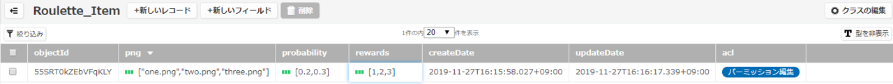]


* 配列アイコン(緑の3本線)がない場合、右端の「型を表示」ボタンを押すと表示されます

.center[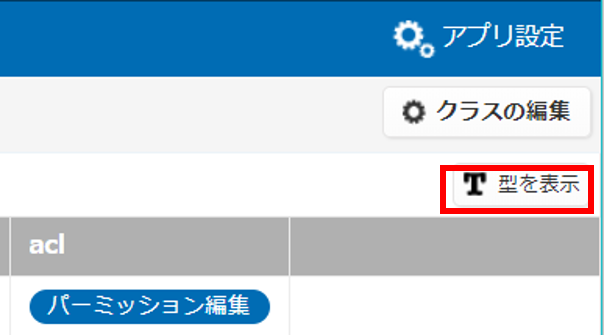]

---

### 6.3【mBaaS】データストアにクラスを準備する手順
* データストアに「Reward」クラスを準備します
 * 賞ごとに「Reward1」「Reward2」「Reward3」を用意
 * 当たった賞のクラスにユーザー名を登録
 
.center[]

---

### 6.3【mBaaS】データストアにクラスを準備する手順
* データストアに「Reward」クラスを準備する手順  
  1. __`データストア`__をクリック  
  2. __`作成を`__クリック  
  3. __`新規作成`__をクリック  
  4. クラス名に __Reward1__ と入力
  5. 作成するをクリック      
  6. 上記手順で同様に __Reward2__ と __Reward3__ も作成    
  
.center[]

---

### 6.3【mBaaS】データストアにクラスを準備する手順
* 作成に成功すると以下のように表示されます
 
.center[]

---


### 6.4【mBaaS】スーパーユーザーの準備
* スーパーユーザーの役割
 * セキュリティを担保するために、このユーザーしかクラスにaclを設定しアクセスできないように工夫しています
 * acl(アクセスコントロールリスト):ユーザーの役割に応じてアクセス可能なデータを制限する際に、ユーザー名とデータとのひも付けを確認するためのリスト

---

### 6.4【mBaaS】スーパーユーザーの準備
* Rewardクラスへのアクセス権限を持ったスーパーユーザーを用意します
 * スーパーユーザー以外は誰もアクセスできないacl設定を施します

.center[]

---

### 6.4【mBaaS】スーパーユーザーの準備
* Rewardクラスへのアクセス権限を持ったスーパーユーザーを用意します
 * スーパーユーザー以外は誰もアクセスできないacl設定を施します
 
.center[]

---

### 6.4【mBaaS】スーパーユーザーの準備
* Rewardクラスへのアクセス権限を持ったスーパーユーザーを用意します
 * スーパーユーザー以外は誰もアクセスできないacl設定を施します

.center[]

---

### 6.4【mBaaS】スーパーユーザーの準備
* スーパーユーザーを用意する  
  1.データストアをクリック  
  2.新しい会員をクリック  
  3.新しい会員の新規作成をクリック  
  4.入力欄が表示されることを確認する   

.center[]

---

### 6.4【mBaaS】スーパーユーザーの準備
* スーパーユーザーを用意する  
  5.userNameに superuser と入力し Enterを押下  
  6.passwordに super と入力し Enterを押下  
* 成功するとユーザーが追加され、passwordがhiddenになります  
* objectIdが自動で割り振られ、この値をacl設定に後ほど使用します  

.center[]

---

### 6.5【mBaaS】参照権限の設定
* 参照権限を設定することのメリットは、書き換えや参照をあるユーザーだけ実行できるように限定することによって、他のユーザーから干渉を受けず、確率の書き換えなど受けなくなる。 
* permissionの設定  
  1.会員管理をクリック  
  2.superuserのobjectIdをコピー  

.center[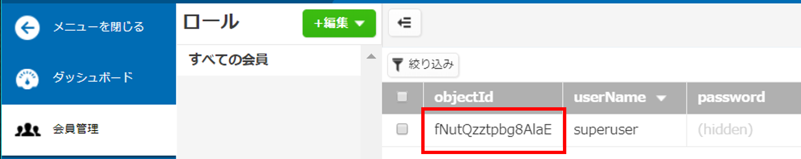]

---

### 6.5【mBaaS】参照権限の設定
* permissionの設定  
  3.データストアをクリック  
  4.Reward1をクリック  
  5.クラスの編集をクリック  
  6.パーミッションの設定をクリック  

.center[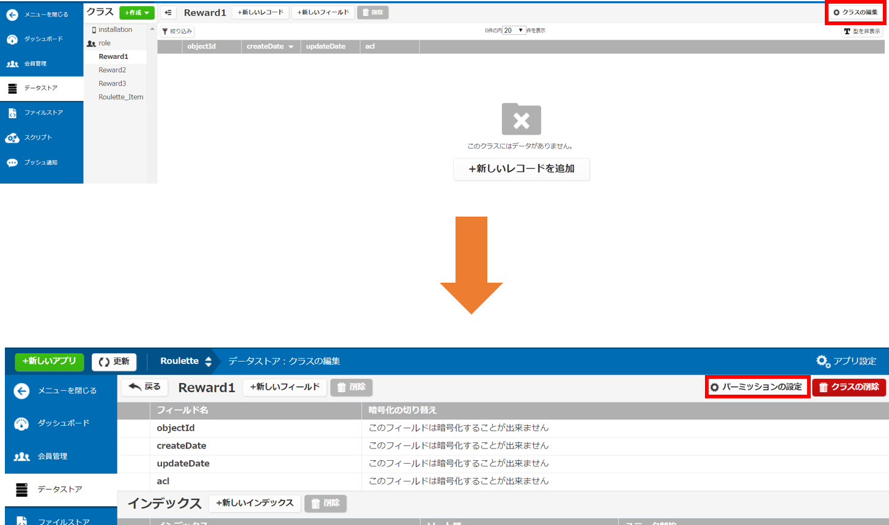]

---

### 6.5【mBaaS】参照権限の設定
* permissionの設定  
  7.新しいパーミッションをクリック  
  8.全員 ▼ をクリック  
  9.会員をクリック  
  10.先ほどコピーしたobjectIdをペースト  
  11.変更を保存をクリック  

.center[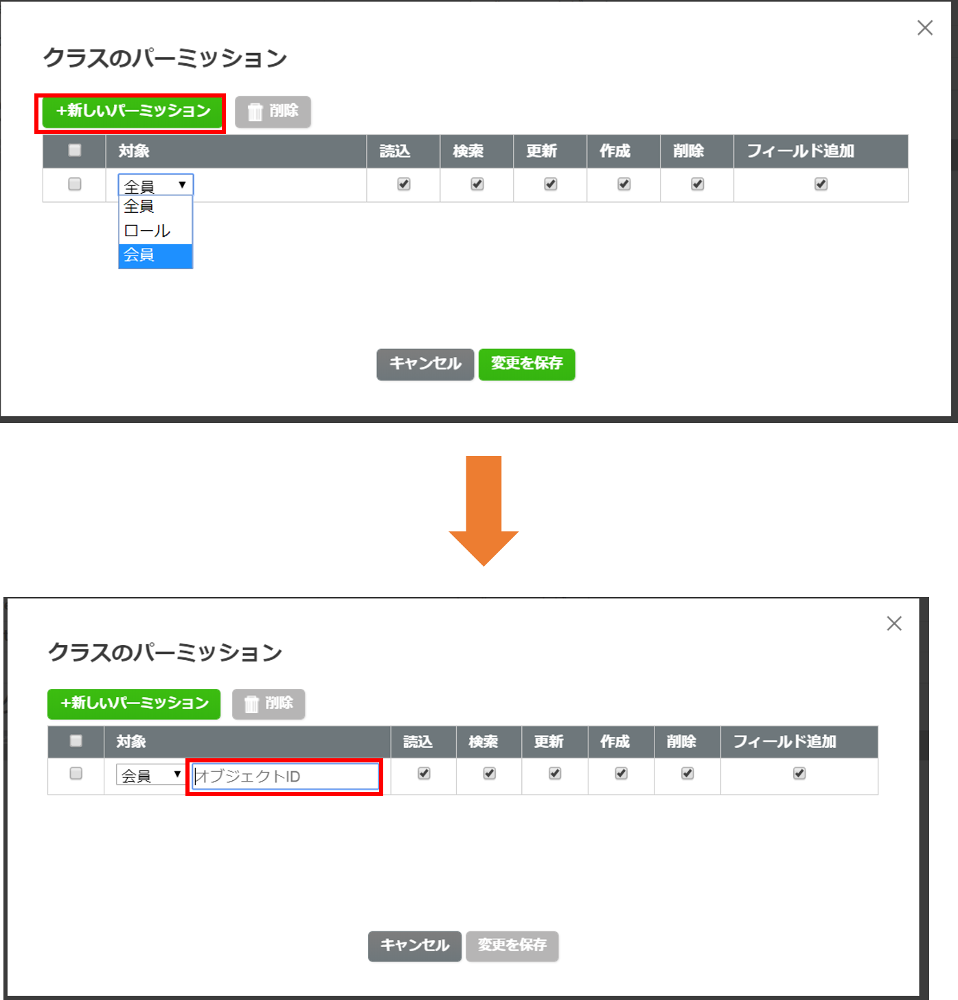]

---

### 6.5【mBaaS】参照権限の設定
 * パーミッションの保存が成功すると緑のポップアップが右上に表示される
  * 手順を Reward2、Reward3に対しても実施する
 
.center[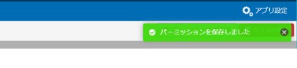]

* 設定されているか確認します  
  1.データストアをクリック  
  2.パーミッションの設定をクリック  
  3.上手く登録されていれば先ほど登録した内容が反映されている    

.center[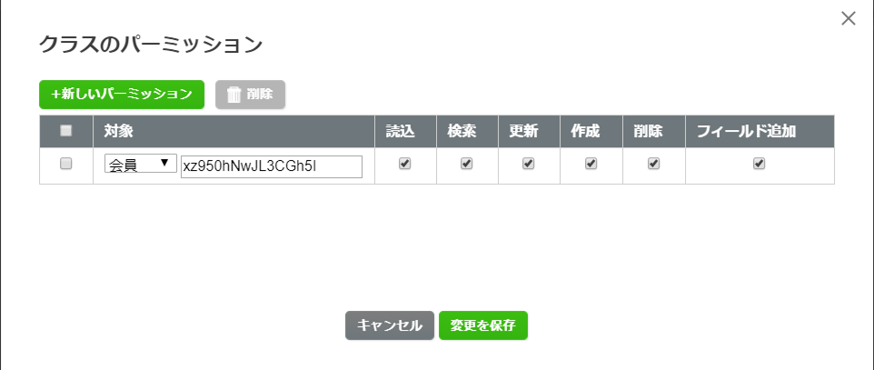]

---

### 6.6【mBaaS】スクリプト準備①SelectReward.js
* 処理内容
  1. Roulette_Itemからルーレットの確率を取得
  2. その確率から1等,2等,3等を算出
  3. 当たった賞の値をRoulette_Itemから取得しMonaca側へ返す

* Point
  * 確率の調整が可能
  * 1等が絶対に当たらない鬼畜設定も可能…

---


### 6.6【mBaaS】スクリプト準備①SelectReward.js
* コード確認

.size_small_7[
```js
module.exports = function (req, res) {
    var NCMB = require('ncmb');
    var ncmb = new NCMB('APPLICATION_KEY', 'CLIENT_KEY');
    var Roulette_Item = ncmb.DataStore('Roulette_Item');

    //Roulette_Itemから確率を取得
    Roulette_Item.fetchAll().then(function (results) {
        //何等が当たったか算出
        var rewardNum = selectReward(results[0].probability);
        if (rewardNum == -1) {
            res.status(500).json({
                "message": "Probabilities of rewards must be defined as Array(length=2)"
            });
        }
        var stopNumber = results[0].rewards[rewardNum];
        var png = results[0].png[rewardNum];
        res.status(200).json({stopNumber,png});
    })
    .catch(function (error) {
        res.status(500).send("Error: " + error);
    });
}

function selectReward(probabilities) {
    // probabilities は Array か
    if (!(Array.isArray(probabilities))) return -1;
    // probabilities の要素数は２か
    if (probabilities.length != 2) return -1;

    const p0 = Number(probabilities[0]); // rewards[0]が選択される確率
    const p1 = Number(probabilities[1]); // rewards[1]が   〃

    // 今回はp0(1等の確率)とp1(2等の確率),から残り(3等の確率)を出している
    var randNum = Math.random();
    if (randNum <= p0) return 0;
    else if (randNum <= p0 + p1) return 1;
    else return 2;
}
```
]

・fetchAll() : 全件検索取得

---

### 6.6【mBaaS】スクリプト準備①SelectReward.js
* 3行目のAPIキーの置き換え  
  1.editorにてSelectReward.jsを開きます  
  2.APPLICATION_KEYとCLIENT_KEYを自分のAPIキーに置き換えします   
  3.各editorにて保存を実施する  
  
```js
    var ncmb = new NCMB('APPLICATION_KEY', 'CLIENT_KEY');
```
---

### 6.6【mBaaS】スクリプト準備①SelectReward.js
* SelectReward.jsをアップロード  
  1.スクリプトをクリック  
  2.アップロードをクリック  

.center[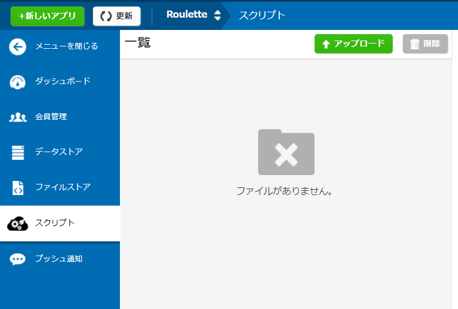]
 
---

### 6.6【mBaaS】スクリプト準備①SelectReward.js
* SelectReward.jsをアップロード  
  3.SelectReward.jsをドラッグアンドドロップかファイル選択  
  4.メソッドはGET  
  5.ファイルの状態は実行可能  
  6.アップロードするをクリック  
  
.center[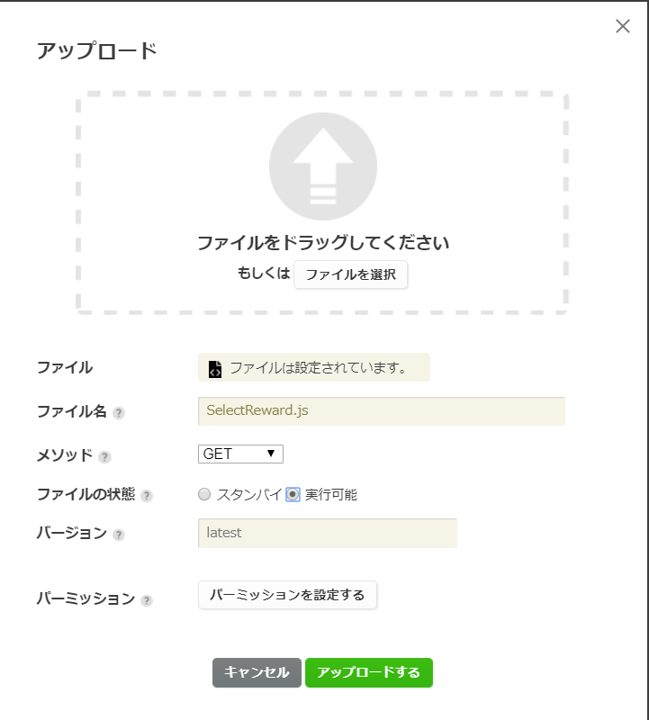]
 
---

### 6.6【mBaaS】スクリプト準備①SelectReward.js
* SelectReward.jsを実行  
  7.SelectReward.jsがアップロードされていることを確認  
  8.SelectReward.jsをクリック  
  9.実行タブをクリック  
  10.実行をクリック  
  
.center[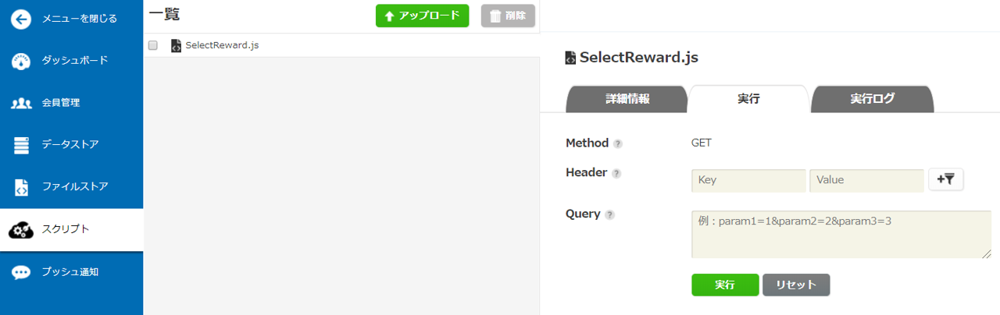]
 
---

### 6.6【mBaaS】スクリプト準備①SelectReward.js
* SelectReward.jsを実行  
  11.以下の警告が出るが実行するをクリック  
  
.center[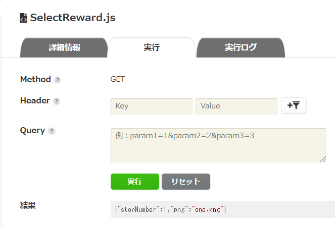]
 
---

### 6.6【mBaaS】スクリプト準備①SelectReward.js
* SelectReward.jsを実行  
  12.実行ボタンの下に結果が出力されていることを確認  
  13.当たった等(stopNumber)とクーポン画像名(png)が取れている  
  
.center[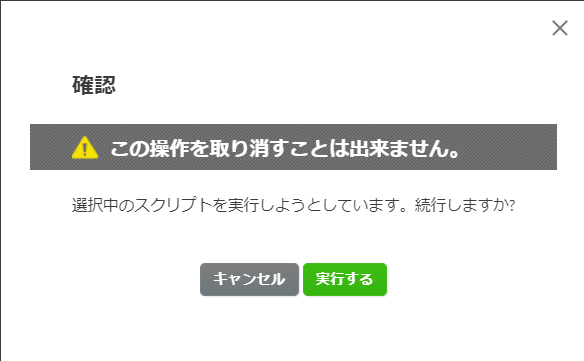]
 
---

### 6.7【mBaaS】スクリプト準備②UserPost.js
* 処理内容  
  1. Monaca側から当たった賞をqueryより取得  
  2. 管理者でログイン  
  3. 当たった賞のログにユーザーの名前があるか検索  
  4. 無ければ登録する(クーポンを表示できるようになる)  

* Point
  * 管理者でしかPOSTできないため、セキュリティ面も安心
  * ハッカーが勝手にユーザーを登録すること防ぐ

---

### 6.7【mBaaS】スクリプト準備②UserPost.js
* コード確認

.size_small_7[
```js
module.exports = function (req, res) {
    var NCMB = require('ncmb');
    var ncmb = new NCMB('APPLICATION_KEY', 'CLIENT_KEY');
    
    var name = String(req.query.user);
    var stopNumber = req.query.stopNumber;
    var StoreName = 'Reward' + String(stopNumber);
    var Reward = ncmb.DataStore(StoreName);
    var user_login = new ncmb.User({userName: "superuser",password: "super"});

    //管理者でログイン
    ncmb.User.login(user_login)
        .then(function (data) {
            //当たった賞がすでにあるか検索
            Reward.equalTo('name', name)
                .fetchAll()
                .then(function(results) {
                    if(results[0]==="" || results[0]===undefined){
                        var nameAdd = new Reward();
                        nameAdd.set("name", name)
                            .save() 
                            .then(function (nameAdd) {
                                nameAdd.set("name", name);
                                return nameAdd.update();
                            })
                            .then(function (success) {
                                res.send("POST data successfully!");   
                            })
                            .catch(function (error) {
                                res.status(500).send("Error: " + error);
                            });
                    }
                    else{
                        res.send("POST data already");
                    }      
                })
                .catch(function (error) {
                    res.status(500).send("Error: " + error);
                });       
        })
        .catch(function (err) {
            res.status(500).send("Error: " + error);
        });
}
```
]

---

### 6.7【mBaaS】スクリプト準備②UserPost.js
* 3行目のAPIキーの置き換え  
  1.editorにてUserPost.jsを開きます  
  2.APPLICATION_KEYとCLIENT_KEYを自分のAPIキーに置き換えします  
  3.各editorにて保存を実施する
  
```js
    var ncmb = new NCMB('APPLICATION_KEY', 'CLIENT_KEY');
```
---

### 6.7【mBaaS】スクリプト準備②UserPost.js
* UserPost.jsをアップロード  
  1.UserPost.jsをドラッグアンドドロップかファイル選択  
  2.メソッドはPOST  
  3.ファイルの状態は実行可能  
  4.アップロードするをクリック  

.center[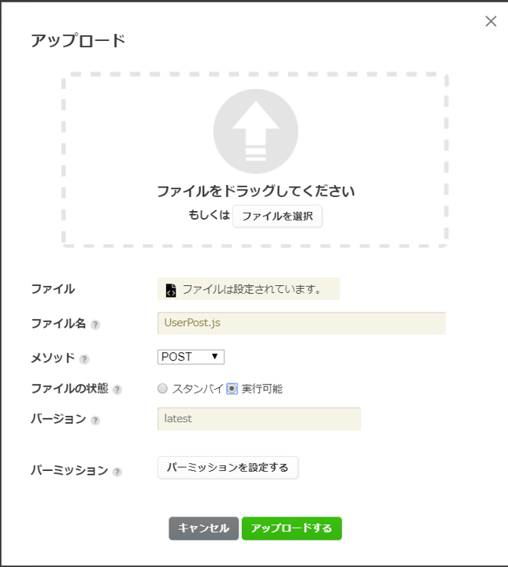]
 
---

### 6.7【mBaaS】スクリプト準備②UserPost.js
* UserPost.jsを実行  
  5.UserPost.jsがアップロードされていることを確認  
  6.UserPost.jsをクリック  
  7.実行タブをクリック  
  8.queryの欄に *user=name&stopNumber=1* を入力  
  9.実行をクリック  
  
.center[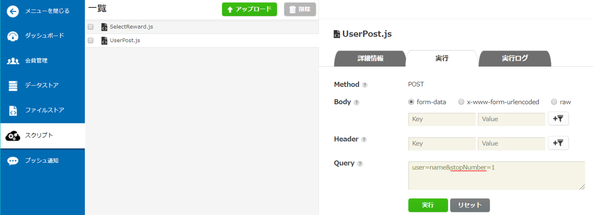]
 
---

### 6.7【mBaaS】スクリプト準備②UserPost.js
* UserPost.jsを実行  
  10.以下の警告が出るが実行するをクリック  
  
.center[]
 
---

### 6.7【mBaaS】スクリプト準備②UserPost.js
* UserPost.jsを実行  
  11.実行ボタンの下に結果が出力されていることを確認  
  12.POST data successfully!と出力されていれば成功
  
.center[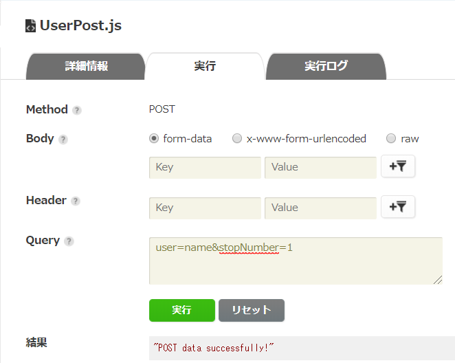]
 
---

### 6.7【mBaaS】スクリプト準備②UserPost.js
* UserPost.jsを実行  
  13.データストアをクリック  
  14.今回はstopNumberを1としたのでReward1をクリック  
  15.nameというユーザーが登録されていれば成功  
  
.center[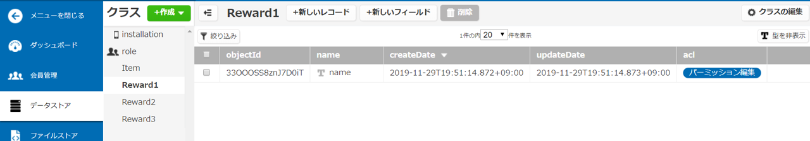]
 
---

### 6.8【mBaaS】スクリプト準備③CouponGet.js
* 処理内容  
  1. 非同期処理スタート、まずは管理者でログイン  
  2. 次にReward1にユーザーがいるか検索  
  3. 存在していれば画像名をRoulette_Itemから取得  
  4. 2,3が終了後Reward2,Reward3と順に同様処理が行われる  

* Point
  * 非同期処理を使用
  * 処理が重ならずに全ての処理の終了後に値が返される
 
---

### 6.8【mBaaS】スクリプト準備③CouponGet.js
* コード確認

.size_small_7[
```js
module.exports = function (req, res) {
    var NCMB = require('ncmb');
    var ncmb = new NCMB('APPLICATION_KEY', 'CLIENT_KEY');

    var Item = ncmb.DataStore('Roulette_Item');
    var Reward1 = ncmb.DataStore('Reward1');
    var Reward2 = ncmb.DataStore('Reward2');
    var Reward3 = ncmb.DataStore('Reward3');
    var name = req.query.user;
    var png1 = "";
    var png2 = "";
    var png3 = "";
    var user_login = new ncmb.User({userName: "superuser",password: "super"});

    const promise = new Promise((resolve, reject) => {
        //管理者でログイン
        ncmb.User.login(user_login).then(function (data) {
                Reward1.equalTo("name", name)
                    .fetchAll().then(function (reward1) {
                        if(reward1[0]==="" || reward1[0]===undefined){
                            png1 = "";
                        }
                        else{
                            Item.fetchAll()
                                .then(function (result1) {
                                    png1 = result1[0].png[0];
                                })
                                .catch(function (error) {
                                    res.status(500).send("Error: " + error);
                                })                        
                        }
                    })
                    .catch(function (error) {
                       res.status(500).send("Error: " + error);
                    })     
                //Reward1と同様な処理を2,3と行うが以下省略
            })    
            .catch(function (error) {
                res.status(500).send("Error: " + error);
            });
    });
    promise.then(() => setTimeout(function () {
        res.status(200).json({png1,png2,png3});
    }, 1000));
}
```
]

・Reward1.equalTo("name", name) : 完全一致検索

---

### 6.8【mBaaS】スクリプト準備③CouponGet.js
* 3行目のAPIキーの置き換え  
 1.editorにてCouponGet.jsを開きます  
 2.APPLICATION_KEYとCLIENT_KEYを自分のAPIキーに置き換えします  
 3.各editorにて保存を実施する  
 
```js
    var ncmb = new NCMB('APPLICATION_KEY', 'CLIENT_KEY');
```
---

### 6.8【mBaaS】スクリプト準備③CouponGet.js
* CouponGet.jsをアップロード  
  1.CouponGet.jsをドラッグアンドドロップかファイル選択  
  2.メソッドはGet  
  3.ファイルの状態は実行可能  
  4.アップロードするをクリック  
  
.center[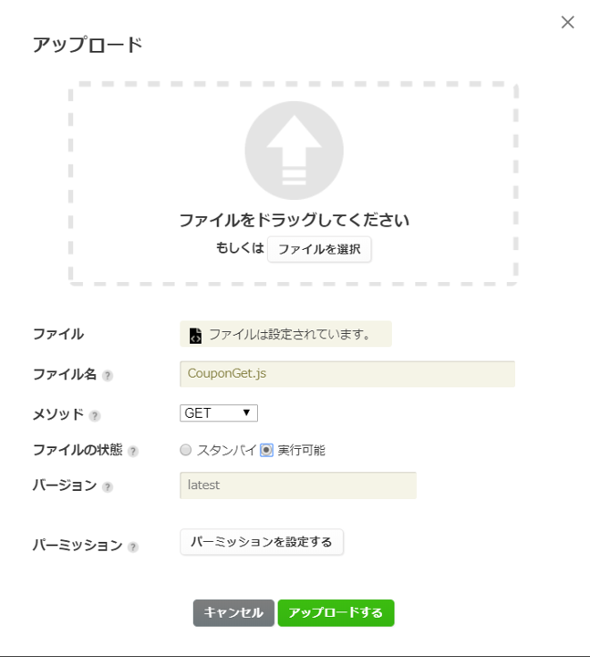]
 
---

### 6.8【mBaaS】スクリプト準備③CouponGet.js
* CouponGet.jsを実行  
  5.CouponGet.jsがアップロードされていることを確認  
  6.CouponGet.jsをクリック  
  7.実行タブをクリック  
  8.queryの欄に *user=name* を入力  
  9.実行をクリック  
  
.center[]
 
---

### 6.8【mBaaS】スクリプト準備③CouponGet.js
* CouponGet.jsを実行  
  10.以下の警告が出るが実行するをクリック  
  
.center[]
 
---

### 6.8【mBaaS】スクリプト準備③CouponGet.js
* CouponGet.jsを実行  
  11.実行ボタンの下に結果が出力されていることを確認  
  12.現在はReward1のクラスなのでone.pngが結果として取得できている
  
.center[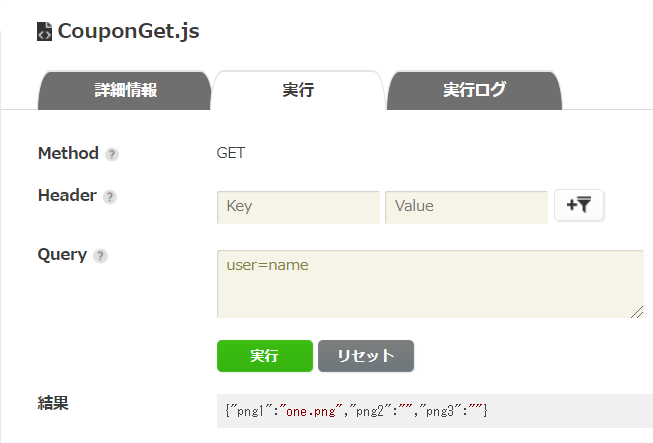]
 
---

### 6.9【Monaca】アプリからスクリプトを呼び出す
* 管理画面上で動作確認（実行してただしくログがでるか）の手順  
  1. app.jsを開きCtrl + F にて検索窓で「//MARK」と検索  
  2. Mark内を大きく①、②、③に分けています  
  3. スクリプト①にてSelectReward.js  
  <br>スクリプト②にてUserPost.js  
  <br>スクリプト③にてCouponGet.jsが呼ばれています  

---

### 6.9【Monaca】アプリからスクリプトを呼び出す ①
* SelectReward.js呼び出しコード確認  
  * 非同期処理にてスクリプトを呼び出し  
  * GETメソッドを使用  

.size_small_7[
```js
const promise = new Promise((resolve, reject) => {
        //MARK: 【NCMB】スクリプト①：ルーレットの当たりを取得
        ncmb.Script.exec("GET", "SelectReward.js")
            .then(function (res) {
                /* スクリプトの実行成功時の処理 */
                resolve();
            })
            .catch(function (err) {
                /* スクリプトの実行失敗時の処理 */
            });
    });
    promise.then(() => setTimeout(function () {
```
]

---

### 6.9【Monaca】アプリからスクリプトを呼び出す ②
* UserPost.js呼び出しコード確認  
  * queryを指定して実行  
  * POSTメソッドを使用  

.size_small_7[
```js
ncmb.Script.query({"user": user.userName,"stopNumber": stopNumber})
                .exec("POST", "UserPost.js")
                .then(function (res) {
                    /* スクリプトの実行成功時の処理 */
                })
                .catch(function (err) {
                    /* スクリプトの実行失敗時の処理 */
                });
```
]

---

### 6.9【Monaca】アプリからスクリプトを呼び出す ③
* CouponGet.js呼び出しコード確認  
  * 非同期処理にてスクリプトを呼び出し  
  * GETメソッドを使用  
  * queryを指定して実行  

.size_small_7[
```js
const promise = new Promise((resolve, reject) => {
        //MARK: 【NCMB】スクリプト③：当たったクーポン画像を取得
        ncmb.Script.query({"user": user.userName})
            .exec("GET", "CouponGet.js")
            .then(function (res) {
                /* スクリプトの実行成功時の処理 */
                resolve();
            })
            .catch(function (err) {
                /* スクリプトの実行失敗時の処理 */
            });
    });
    // クーポンページの画像をロードする
    promise.then(() => setTimeout(function () {
}
```
]

---

### 6.10【動作確認】
* 管理画面上で動作確認（実行してただしくログがでるか）の手順  
  1.好きなユーザー名と、パスワードを入力し新規ログイン  

.center[]

---

### 6.11【動作確認】
* 管理画面上で動作確認（実行してただしくログがでるか）の手順  
  2.正常にログインできると、このルーレット画面に遷移  
  3.スタートボタンを押してルーレット開始  

.center[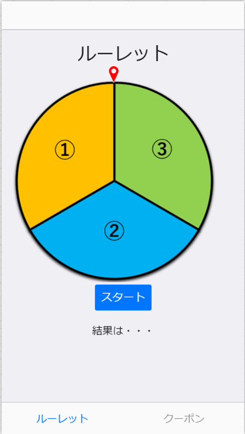]

---

### 6.11【動作確認】
* 管理画面上で動作確認（実行してただしくログがでるか）の手順  
  4.ルーレット回転(この時回転までに数秒の間があります)  
  5.ルーレット停止すると結果を表示  

.center[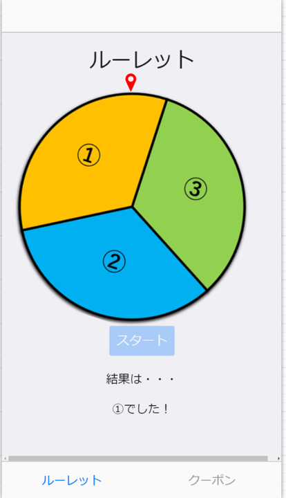]

---

### 6.11【動作確認】
* 管理画面上で動作確認（実行してただしくログがでるか）の手順  
  6.クーポンページに遷移  
  7.Reloadボタンを押す  
  8.当たったクーポンが表示される  
  
.center[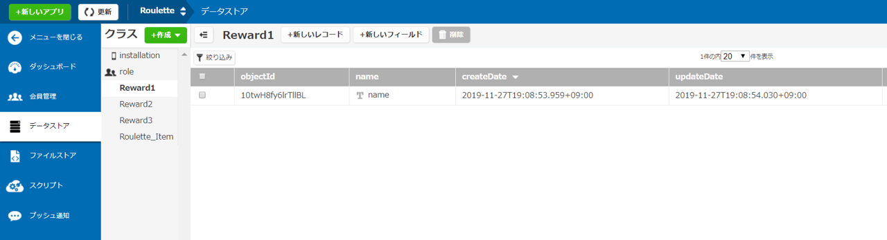]

---

layout: true
class: center, middle, inverse
---
# 7.まとめと振り返り

---
layout: false

### まとめと振り返り
* 
