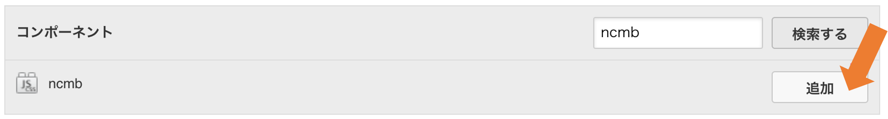
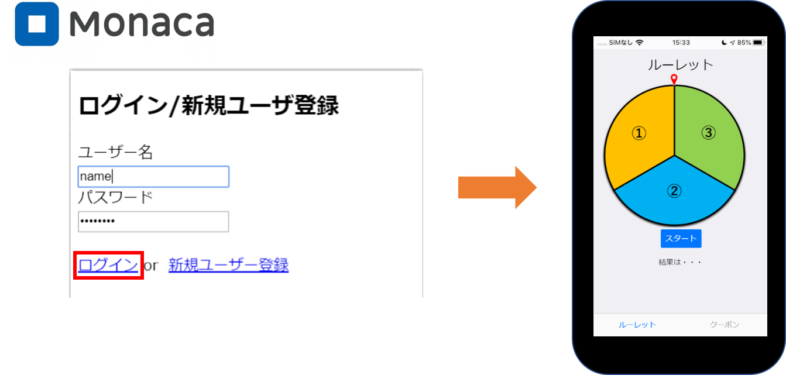

name: inverse
layout: true
class: center, middle, inverse

---
# 【Monacaハンズオン】
# サーバーレスでルーレットアプリに クーポン機能を実装してみよう！

@ 富士通クラウドテクノロジーズ 株式会社

.footnote[
 20191125作成
]

---
layout: true
class: center, middle, inverse
---
# 0.目次

---
layout: false

### 目次
.size_large[
1.  __作成するアプリについて__
2. __アプリ作成に使うツール__
3.  __事前準備__
4. __構成図__
5.  __ハンズオンの準備__
6. __ルーレット機能の作成__
    ]

---
layout: true
class: center, middle, inverse
---

# 1.作成するアプリについて

---
layout: false

### 概要
* ニフクラ mobile backendの『スクリプト機能』を利用して 
__`サーバーレスでルーレットアプリにクーポン機能を実装します`__
* サーバーレスとは?  __`サーバーを用意する必要なく`__ 、アプリ機能を作成できるということです

.center[]

---
layout: true
class: center, middle, inverse
---
# 2.アプリ作成に使うツール

---
layout: false

### 2.1[Monaca](https://ja.monaca.io/) 紹介
* __`開発環境の構築は不要`__ 全ての時間をアプリ開発へサービス
* __`アプリ開発専用エディタ`__ でいつでも、どこでも快適に
* __`無料`__ で体験頂けます
* ローカル開発にも完全対応いつもの環境を __`クラウドと連携`__
* HTMLとCSSでアプリのUIを __`誰でも簡単開発`__

.center[]

---

### 2.2[ニフクラ mobile backend](http://mbaas.nifcloud.com/about.htm) 紹介
* スマートフォンアプリに必要なバックエンド機能が __`開発不要で利用できる`__ クラウドサービス
* クラウド上に用意された機能を __`APIを呼び出すだけで利用できます`__
* __`無料`__ で体験頂けます
* APIを利用するためのSDKは幅広く対応します (Swift / iOS / Android / JavaScript / Monaca / Unity)
* mobile Backend as a Service の頭文字を取って、通称 __`mBaaS`__ 呼ばれます

.center[]

---
### 3.事前準備
* [Monaca](https://monaca.mobi/ja/signup)の利用登録（無料）
* [ニフクラ mobile backend (mBaaS)](http://mbaas.nifcloud.com/signup.htm)の利用登録（無料）
* テキストエディタお持ちでない方はご準備をお願いします
 VSCodeはこちらから_ https://azure.microsoft.com/ja-jp/products/visual-studio-code/
---

### 4.構成図(全体の流れ)
ルーレットを回してクーポンを獲得する簡単なデモゲームアプリを作ります

* __`データストア機能`__ と __`スクリプト機能`__ を使ってアプリに __`ルーレット機能`__ を実装します  
 構成図以下のようになっています

.center[]
---

### 4.構成図(会員管理)
ルーレットを回してクーポンを獲得する簡単なデモゲームアプリを作ります

* __`データストア機能`__ と __`スクリプト機能`__ を使ってアプリに __`ルーレット機能`__ を実装します
構成図以下のようになっています

.center[]
---

### 4.構成図(ルーレット処理)
ルーレットを回してクーポンを獲得する簡単なデモゲームアプリを作ります

* __`データストア機能`__ と __`スクリプト機能`__ を使ってアプリに __`ルーレット機能`__ を実装します
構成図以下のようになっています

.center[]
---

### 4.構成図(クーポン処理)
ルーレットを回してクーポンを獲得する簡単なデモゲームアプリを作ります

* __`データストア機能`__ と __`スクリプト機能`__ を使ってアプリに __`ルーレット機能`__ を実装します
構成図以下のようになっています

.center[]
---

### ハンズオンの流れ
.size_large[
5.  __ハンズオンの準備(前半)__
    - 5.1【Monaca】アプリ側の準備
    - 5.2【mBaaS】サーバー側の準備
    - 5.3【Monaca】mBaaSを使うための準備
    - 5.4  動作確認①
    - 5.5  設定ファイルのDL
    - 5.6【mBaaS】クーポン画像の準備
6. __ルーレット機能の作成(後半)__
    - 6.1【mBaaS】データストアにクラスを準備
    - 6.2【mBaaS】スクリプト準備①SelectReward.js
    - 6.3【mBaaS】スーパーユーザーの準備
    - 6.4【mBaaS】スクリプト準備②UserPost.js
    - 6.5【mBaaS】スクリプト準備③CouponGet.js
    - 6.6【Monaca】アプリからスクリプトを呼び出す
    - 6.7【mBaaS】動作確認②
    ]
---
layout: true
class: center, middle, inverse
---
# 5.ハンズオンの準備

---
layout: false

### 5.1【Monaca】アプリ側の準備
* Monacaアプリケーションをimportします
1. [プロジェクト](https://00m.in/WlLhX)をクリック
2. __`インポート`__ をクリック
3. __`クラウドIDEで開く`__  をクリック

.center[]

---

### 5.1【Monaca】アプリ側の準備
* SDKの導入（コンポーネントの追加）
1. __`設定`__ をクリック
2. __`JS/CSSコンポーネントの追加と削除`__ をクリック

.center[]

---

### 5.1【Monaca】アプリ側の準備
* SDKの導入（コンポーネントの追加）
1. __`コンポーネント名`__ に __`ncmb `__と入力
2. __`検索する`__ をクリック

.center[]

---

### 5.1【Monaca】アプリ側の準備
* SDKの導入（コンポーネントの追加）
__`ncmb`__ が表示されるので __`追加`__

.center[]

---

### 5.1【Monaca】アプリ側の準備
* SDKの導入（コンポーネントの追加）
バージョンはそのままで、 __`インストール`__ をクリック

.center[]

---

### 5.1【Monaca】アプリ側の準備
* SDKの導入（コンポーネントの追加）
必ずチェックボックスにチェックを入れて、 __`保存`__  をクリック

.center[]

---

### 5.1【Monaca】アプリ側の準備
* SDKの導入（コンポーネントの追加）
一覧に __`ncmb`__ が表示されればSDK導入完了です

.center[]

---

### 5.2【mBaaS】サーバー側の準備
* アプリAPIキーの作成をします
* [mBaaS](http://mbaas.nifcloud.com)のダッシュボードを開きます
* 画面の左上にある「新しいアプリ」ボタンをクリックし、新規作成画面を開きます
* アプリ名は __`Roulette`__ とします
* `新規作成`ボタンをクリックしてアプリを作成します

.center[]

---
### 5.3【Monaca】mBaaSを使うための準備
* MonacaSDKにアプリAPIキーを設定します
* APIキーの画面で`コピー`ボタンをクリックすると __`アプリケーションキー`__ と __`クライアントキー`__ をコピーすることができます
* Monaca画面で __`app.js`__コンポーネントの入力欄に、以下の2つのAPIキーをそれぞれ入力します
    - __Application_Key__欄 : アプリケーションキー
    - __Client_Key__欄 : クライアントキー

.center[]

---
### 5.4 動作確認① (新規登録処理)
* 新規会員登録をしたときの実行結果
.center[]

---

### 5.4 動作確認① (ログイン処理)
* ログインしたときの実行結果

.center[]

---

### 5.4 動作確認① (ログイン処理)
* Monaca側には以下のようにErrorが出てきますが、そのままで大丈夫です。

.center[]

---

### 5.5 設定ファイルのDL
* 設定ファイル --> [ダウンロード](https://kobayashi-masaya.github.io/MonacaRouletteApp_Setting.zip)
* ファイル構成は以下の通りです。

.center[]

---

### 5.6【mBaaS】クーポン画像の準備
* ファイルストアへのアップロード手順
 1. ファイルストアをクリック
 2. アップロードをクリック
 3. imgフォルダの画像3つをアップロードする

.center[]

---
layout: true
class: center, middle, inverse
---
# 6.ルーレット機能の作成

---
layout: false

### 6.1【mBaaS】データストアにクラスを準備する手順
* データストアに「Roulette_Item」クラスを準備する手順
 
.center[]

---

### 6.2【mBaaS】スクリプト準備①SelectReward.js
* 処理内容
  1. Roulette_Itemからルーレットの確率を取得
  2. その確率から1等,2等,3等を算出
  3. 当たった賞の値をRoulette_Itemから取得しMonaca側へ返す

* Point
  * 確率の調整が可能
  * 1等が絶対に当たらない鬼畜設定も可能…

---

### 6.3【mBaaS】スーパーユーザーの準備
* 下記の手順で実施します

.center[]

---

### 6.3【mBaaS】スーパーユーザーの準備
* 下記の手順で実施します

.center[]

---

### 6.4【mBaaS】スクリプト準備②UserPost.js
* 処理内容
  1. Monaca側から当たった賞をqueryより取得
  2. 管理者でログイン
  3. 当たった賞のログにユーザーの名前があるか検索
  4. 無ければ登録する(クーポンを表示できるようになる)

* Point
  * 管理者でしかPOSTできないため、セキュリティ面も安心
  * ハッカーが勝手にユーザーを登録すること防ぐ

---

### 6.5【mBaaS】スクリプト準備③CouponGet.js
* 処理内容
  1. 非同期処理スタート、まずは管理者でログイン
  2. 次にReward1にユーザーがいるか検索
  3. 存在していれば画像名をRoulette_Itemから取得
  4. 2,3が終了後Reward2,Reward3と順に同様処理が行われる

* Point
  * 非同期処理を使用
  * 処理が重ならずに全ての処理の終了後に値が返される
 
---
  
### 6.6【Monaca】アプリからスクリプトを呼び出す
* 管理画面上で動作確認（実行してただしくログがでるか）の手順
  1. app.jsにてCtrl + F にて検索窓を開き「//MARK」で検索
  2. Mark内を大きく①、②、③に分けています。
  3. ①にてSelectReward.js
   ②にてUserPost.js
   ③にてCouponGet.jsが呼ばれています。

---

### 6.6【Monaca】アプリからスクリプトを呼び出す ①
* 非同期処理にてスクリプトを呼び出し
* GETメソッドを使用

.center[]

---

### 6.6【Monaca】アプリからスクリプトを呼び出す ②
* queryを指定して実行
* POSTメソッドを使用

.center[]

---

### 6.6【Monaca】アプリからスクリプトを呼び出す ③
* 非同期処理にてスクリプトを呼び出し
* queryを指定して実行
* GETメソッドを使用

.center[]

---

### 6.7【動作確認】
* 管理画面上で動作確認（実行してただしくログがでるか）の手順
 

---
layout: true
class: center, middle, inverse
---
# 7.まとめと振り返り

---
layout: false

### まとめと振り返り
* 
