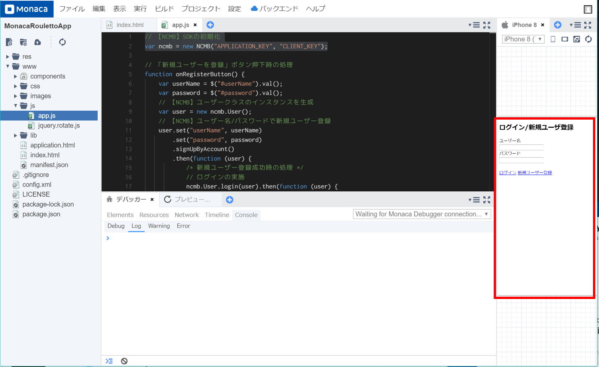
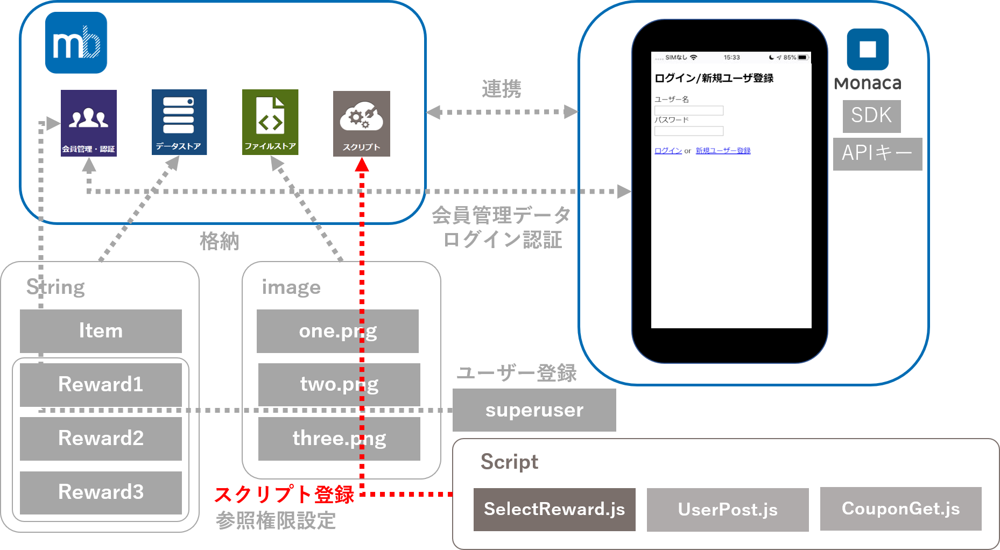

name: inverse
layout: true
class: center, middle, inverse

---
# <span style="font-size: 60%">【Monacaハンズオン】</span>
# <span style="font-size: 70%">サーバーレスでルーレットアプリに<br>クーポン機能を実装してみよう！</span>

@ 富士通クラウドテクノロジーズ 株式会社

.footnote[
 20191203作成
]

---
layout: true
class: center, middle, inverse
---
# 0.目次

---
layout: false

### 目次
.size_large[
1.  __作成するアプリについて__
2. __アプリ作成に使うツール__
3.  __事前準備__
4. __ハンズオンの内容__
5.  __ハンズオンの準備__
6. __ルーレット機能の作成__
    ]

---
layout: true
class: center, middle, inverse
---

# 1.作成するアプリについて

---
layout: false

### 概要
* ニフクラ mobile backendの『スクリプト機能』を利用して<br>
__`サーバーレスでルーレットアプリにクーポン機能を実装します`__
* サーバーレスとは?<br> __`サーバーを用意する必要なく`__ 、アプリ機能を作成できるということです

.center[]

---
layout: true
class: center, middle, inverse
---
# 2.アプリ作成に使うツール

---
layout: false

### 2.1 Monaca 紹介
* クラウド環境にアクセスするだけで __`開発環境の構築は不要`__  
* ブラウザ上でコーディングができる高機能なエディタ
* __`無料`__ で体験頂けます
* ローカル開発にも完全対応いつもの環境を __`クラウドと連携`__
* HTMLとCSSでアプリのUIを誰でも __`簡単に開発`__ できます

.center[]

---

### 2.2 ニフクラ mobile backend 紹介
* スマートフォンアプリに必要なバックエンド機能が __`開発不要で利用できる`__ クラウドサービス
* クラウド上に用意された機能を __`APIを呼び出すだけで利用できます`__
* __`無料`__ で体験頂けます
* APIを利用するためのSDKは幅広く対応します (Swift / iOS / Android / JavaScript / Monaca / Unity)
* mobile Backend as a Service の頭文字を取って、通称 __`mBaaS`__ 呼ばれます

.center[]

---
layout: true
class: center, middle, inverse
---
# 3.事前準備
---
layout: false

### 3.事前準備
* Monacaの利用登録（無料）
<br>https://monaca.mobi/ja/signup
* ニフクラ mobile backend (mBaaS) の利用登録（無料） 
<br> http://mbaas.nifcloud.com/signup.htm
* テキストエディタお持ちでない方はご準備をお願いします
<br>VSCodeはこちらから https://azure.microsoft.com/ja-jp/products/visual-studio-code/
---

layout: true
class: center, middle, inverse
---
# 4.ハンズオンの内容
---
layout: false

### 4.ハンズオンの内容
ルーレットを回してクーポンを獲得する簡単なデモゲームアプリを作ります

* __`スクリプト機能`__ をはじめとするmBaaSの機能を使って
<br>アプリに __`ルーレット機能`__ を実装します
<br>画面遷移図は以下のようになっています

.center[]
---


### ハンズオンの流れ
.size_large[
5.  __ハンズオンの準備(前半)__
    - 5.1【Monaca】アプリ側の準備
    - 5.2【mBaaS】サーバー側の準備
    - 5.3【Monaca】mBaaSを使うための準備
    - 5.4  動作確認①
6. __ルーレット機能の作成(後半)__
    - 6.1  設定ファイルのDL
    - 6.2【mBaaS】クーポン画像の準備
    - 6.3【mBaaS】データストアにクラスを準備
    - 6.4【mBaaS】スーパーユーザーの準備
    - 6.5【mBaaS】参照権限の設定
    - 6.6【mBaaS】スクリプト準備①SelectReward.js
    - 6.7【mBaaS】スクリプト準備②UserPost.js
    - 6.8【mBaaS】スクリプト準備③CouponGet.js
    - 6.9【Monaca】アプリからスクリプトを呼び出す
    - 6.10【mBaaS】動作確認②
    ]
---
layout: true
class: center, middle, inverse
---
# 5.ハンズオンの準備

---
layout: false

### 5.1【Monaca】アプリ側の準備
* アプリのインポートとMonacaSDKをMonaca側に設定し連携していきます
 * SDKの導入
 * アプリのインポート
 
.center[]

---

### 5.1【Monaca】アプリ側の準備
* アプリのインポートとMonacaSDKをMonaca側に設定し連携していきます
 * SDKの導入
 * アプリのインポート
.center[]

---

### 5.1【Monaca】アプリ側の準備
* Monacaアプリケーションをimportします
1. Monaca(https://monaca.mobi/ja/signup) にログイン
2. importリンク (https://00m.in/WlLhX) をクリック
3. __`インポート`__ をクリック
4. __`クラウドIDEで開く`__  をクリック

.center[]

---

### 5.1【Monaca】アプリ側の準備
* importに成功すると以下の画面が表示されます

.center[]

---

### 5.1【Monaca】アプリ側の準備
* SDKの導入（コンポーネントの追加）  
  1.上タブの __`設定`__ をクリック  
  2.__`JS/CSSコンポーネントの追加と削除`__ をクリック  

.center[]

---

### 5.1【Monaca】アプリ側の準備
* SDKの導入（コンポーネントの追加）  
  3.__`コンポーネント名`__ に __`ncmb `__ と入力    
  4.__`検索する`__ をクリック  

.center[]

---

### 5.1【Monaca】アプリ側の準備
* SDKの導入（コンポーネントの追加）  
  5.__`ncmb`__ が表示されるので __`追加`__ をクリック  

.center[]

---

### 5.1【Monaca】アプリ側の準備
* SDKの導入（コンポーネントの追加）  
  6.バージョンはそのままで、 __`インストール`__ をクリック  

.center[]

---

### 5.1【Monaca】アプリ側の準備
* SDKの導入（コンポーネントの追加）  
  7.必ずチェックボックスにチェックを入れて、 __`保存`__  をクリック  

.center[]

---

### 5.1【Monaca】アプリ側の準備
* SDKの導入（コンポーネントの追加）  
  8.一覧に __`ncmb`__ が表示されればSDK導入完了です  

.center[]

---

### 5.2【mBaaS】サーバー側の準備
* mBaaS側で払い出されたAPIキーをMonaca側に設定し連携していきます

.center[]

---

### 5.2【mBaaS】サーバー側の準備
* mBaaS側で払い出されたAPIキーをMonaca側に設定し連携していきます

.center[]

---

### 5.2【mBaaS】サーバー側の準備
* mBaaS(https://console.mbaas.nifcloud.com/) にログイン
* 新しいアプリを作成します
* アプリ名を __`Roulette`__ と入力し「`新規作成`」をクリックします

.center[]

* mobile backend を既に使用したことがある場合は、画面上方のメニューバーにある「`+新しいアプリ`」をクリックすると同じ画面が表示されます

.center[]

---

### 5.2【mBaaS】サーバー側の準備
* アプリ作成が成功すると以下の画像が表示されます
 * この __`アプリケーションキー`__ と __`クライアントキー`__ を合わせてアプリAPIキーと呼びます

.center[]

---


### 5.3【Monaca】mBaaSを使うための準備
* MonacaSDKにアプリAPIキーを設定します
 * js/app.js を開きます
  * 左のファイル一覧より ▶ www の ▶をクリック
.center[]

---

### 5.3【Monaca】mBaaSを使うための準備
* MonacaSDKにアプリAPIキーを設定します
 * js/app.js を開きます
  * 左のファイル一覧より ▶ js の ▶をクリック
.center[]

---

### 5.3【Monaca】mBaaSを使うための準備
* MonacaSDKにアプリAPIキーを設定します
 * js/app.js を開きます
  * 左のファイル一覧より app.js をダブルクリック
.center[]

---

### 5.3【Monaca】mBaaSを使うための準備
* MonacaSDKにアプリAPIキーを設定します
 * js/app.js を開きます
  * 黒い画面にapp.jsが映し出される
.center[]

---

### 5.3【Monaca】mBaaSを使うための準備
* MonacaSDKにアプリAPIキーを設定します
 * __`APPLICATION_KEY`__ と __`CLIENT_KEY`__ を mobile backend でアプリ作成時に発行された２つの APIキー （アプリケーションキーとクライアントキー）に貼り替えます
 * 張り替え後、Ctrl + s で変更を保存
```js
// 【NCMB】SDKの初期化
var ncmb = new NCMB("APPLICATION_KEY", "CLIENT_KEY");
```

---

### 5.3【Monaca】mBaaSを使うための準備
* 設定完了後は以下の画像のようになります

.center[]

---

### 5.4 動作確認① (会員管理)
* ここでmBaaSとMonacaが連携できたかを以下の画像のように、会員管理データのやり取りが行われることで確認していきます

.center[]

---
### 5.4 動作確認① (新規登録処理)
* Monacaのプレビュー画面にてアプリを新規会員登録をしましょう
* プレビュー画面は以下の画像の赤線の枠内です

.center[]


---
### 5.4 動作確認① (新規登録処理)
* プレビュー画面に、ユーザー名を __`name`__ 、 パスワードを好きな文字で入力し、 __`新規ユーザー登録`__ をクリックします

.center[]

---
### 5.4 動作確認① (新規登録処理)
* mBaaSの管理画面へ行き、会員管理をクリック

.center[]

---
### 5.4 動作確認① (新規登録処理)
* mBaaSの管理画面へ行き、会員管理をクリック
 * 新規登録に成功していると以下の画像のように追加されます
 * Passwordはセキュリティ上hiddenとなっています

.center[]

---

### 5.4 動作確認① (ログイン処理)
* 先ほど新規会員登録したユーザー―でログインをします
 * 今回はログアウトボタンを実装していないため、画面をリロードしログイン画面に戻ります。
 * 右側のプレビュー画面にリロードボタンがございますのでクリックします
 
.center[]

---

### 5.4 動作確認① (ログイン処理)
* 先ほど新規会員登録したユーザー―でログインをします
 * 先ほど登録したユーザー名とパスワードを入力し __`ログイン `__ をクリック
 * ログインに成功するとルーレット画面が表示されます

.center[]

---

### 5.4 動作確認① (ログイン処理)
* Monaca側には以下のようにErrorが出てきますが、そのままで大丈夫です


.center[]

---
layout: true
class: center, middle, inverse
---

# 6.ルーレット機能の作成

---
layout: false

### 6.ルーレット機能の作成
* データストアとファイルストアに今回使用するデータをアップしていきます

.center[]

---

### 6.ルーレット機能の作成
* データストアとファイルストアに今回使用するデータをアップしていきます

.center[]

---

### 6.1 設定ファイルのDL
* 設定ファイルをダウンロード(http://u0u1.net/RONw)
* ファイル構成は以下の通りです

.center[]

---

### 6.2【mBaaS】クーポン画像の準備
* ファイルストアへのアップロード手順
 1. ファイルストアをクリック
 2. アップロードをクリック
 3. imgフォルダの画像3つをドラッグかファイルを選択
 4. アップロードするをクリック

.center[]

---

### 6.2【mBaaS】クーポン画像の準備
* アップロードに成功すると以下の画像が表示されます

.center[]

---

### 6.3【mBaaS】データストアにクラスを準備する手順
* データストアに「Roulette_Item」クラスを準備する手順
 * このクラスではファイルストアの画像名、確率、賞の値を持たせます
 
.center[]

---


### 6.3【mBaaS】データストアにクラスを準備する手順
* データストアに「Roulette_Item」クラスを準備する手順
 1. データストアをクリック
 2. 作成をクリック
 3. 新規作成をクリック
 4. クラス名に __'Roulette_Item'__ と入力し作成するをクリック
 
.center[]

---


### 6.3【mBaaS】データストアにクラスを準備する手順
* データストアに「Roulette_Item」クラスを準備する手順
 1. 新しいフィールドをクリック
 2. フィールド名に probability と入力し作成するをクリック
 3. この手順で、フィールド名、rewards と png も作成
 
.center[]

---

### 6.3【mBaaS】データストアにクラスを準備する手順
* 3つのフィールドの作成に成功すると以下の図のような構成になる
 * それぞれのフィールドは以下の用途で用意しています
 * probability: 確率の値
 * rewards: 何等の値か
 * png: クーポン画像名
 
.center[]

---

### 6.3【mBaaS】データストアにクラスを準備する手順
* データストアに「Roulette_Item」クラスを準備する手順
 1. 新しいレコードをクリック
 2. png の下の(undefined)をダブルクリックし ["one.png","two.png","three.png"] に差し替え
 3. 下に出てくるポップアップの 文字列▼ をクリックし 配列に変更
 4. 差し替えたテキストボックスをクリックした後にEnter
 5. 上記の手順と同様進め、 probabilityは [0.2,0.3]、rewardsは[1,2,3]で定義
 
.center[]

---

### 6.3【mBaaS】データストアにクラスを準備する手順
* データストアに「Reward」クラスを準備する手順
 * 賞が当たるとユーザーがPOSTされるクラス
 * 賞ごとに「Reward1」「Reward2」「Reward3」と用意
 
.center[]

---

### 6.3【mBaaS】データストアにクラスを準備する手順
* データストアに「Reward」クラスを準備する手順
 1. データストアをクリック
 2. 作成をクリック
 3. 新規作成をクリック
 4. クラス名に __'Reward1'__ と入力し作成するをクリック
 5. 上記手順で同様に __'Reward2'__ と __'Reward3'__ も作成
.center[]

---

### 6.3【mBaaS】データストアにクラスを準備する手順
* 作成に成功すると以下の画像のようになる
 
.center[]

---

### 6.4【mBaaS】スーパーユーザーの準備
* Rewardクラスへのアクセス権限を持ったスーパーユーザーを用意します
 * このユーザー以外はアクセス誰もアクセスできない設定をします

.center[]

---

### 6.4【mBaaS】スーパーユーザーの準備
* Rewardクラスへのアクセス権限を持ったスーパーユーザーを用意します
 * このユーザー以外はアクセス誰もアクセスできない設定をします

.center[]

---

### 6.4【mBaaS】スーパーユーザーの準備
* Rewardクラスへのアクセス権限を持ったスーパーユーザーを用意します
 * このユーザー以外はアクセスできないacl設定をしていきます

.center[]

---

### 6.4【mBaaS】スーパーユーザーの準備
 1. 新しい会員をクリック
 2. 新しい会員の新規作成をクリック
 3. すると入力欄が表示されます

.center[]

---

### 6.4【mBaaS】スーパーユーザーの準備
 4. userNameに superuser と入力し Enter
 5. passwordに super と入力し Enter
 6. 成功するとユーザーが追加され、passwordがhiddenになる
 7. objectIdが自動で割り振られ、この値をacl設定に後ほど使用します

.center[]

---

### 6.5【mBaaS】参照権限の設定


.center[]

---

### 6.6【mBaaS】スクリプト準備①SelectReward.js
* 処理内容
  1. Roulette_Itemからルーレットの確率を取得
  2. その確率から1等,2等,3等を算出
  3. 当たった賞の値をRoulette_Itemから取得しMonaca側へ返す

* Point
  * 確率の調整が可能
  * 1等が絶対に当たらない鬼畜設定も可能…

---

### 6.7【mBaaS】スクリプト準備②UserPost.js
* 処理内容
  1. Monaca側から当たった賞をqueryより取得
  2. 管理者でログイン
  3. 当たった賞のログにユーザーの名前があるか検索
  4. 無ければ登録する(クーポンを表示できるようになる)

* Point
  * 管理者でしかPOSTできないため、セキュリティ面も安心
  * ハッカーが勝手にユーザーを登録すること防ぐ

---

### 6.8【mBaaS】スクリプト準備③CouponGet.js
* 処理内容
  1. 非同期処理スタート、まずは管理者でログイン
  2. 次にReward1にユーザーがいるか検索
  3. 存在していれば画像名をRoulette_Itemから取得
  4. 2,3が終了後Reward2,Reward3と順に同様処理が行われる

* Point
  * 非同期処理を使用
  * 処理が重ならずに全ての処理の終了後に値が返される
 
---
  
### 6.9【Monaca】アプリからスクリプトを呼び出す
* 管理画面上で動作確認（実行してただしくログがでるか）の手順
  1. app.jsにてCtrl + F にて検索窓を開き「//MARK」で検索
  2. Mark内を大きく①、②、③に分けています
  3. ①にてSelectReward.js
  <br>②にてUserPost.js
  <br>③にてCouponGet.jsが呼ばれています

---

### 6.9【Monaca】アプリからスクリプトを呼び出す ①
* 非同期処理にてスクリプトを呼び出し
* GETメソッドを使用

.center[]

---

### 6.9【Monaca】アプリからスクリプトを呼び出す ②
* queryを指定して実行
* POSTメソッドを使用

.center[]

---

### 6.10【Monaca】アプリからスクリプトを呼び出す ③
* 非同期処理にてスクリプトを呼び出し
* queryを指定して実行
* GETメソッドを使用

.center[]

---

### 6.11【動作確認】
* 管理画面上で動作確認（実行してただしくログがでるか）の手順
 

---
layout: true
class: center, middle, inverse
---
# 7.まとめと振り返り

---
layout: false

### まとめと振り返り
* 
