name: inverse
layout: true
class: center, middle, inverse

---
# <span style="font-size: 60%">【はじめてのスクリプト講座】</span>
# <span style="font-size: 70%">サーバーレスでルーレットアプリに<br>クーポン機能を実装してみよう！</span>

@ 富士通クラウドテクノロジーズ 株式会社

.footnote[
 20191203作成
]

---
layout: true
class: center, middle, inverse
---
# 0.目次
---
layout: false

### 目次 
1.__作成するアプリについて__  
2.__アプリ作成に使うツール__  
3.__アカウント準備__  
4.__ハンズオンの内容__   
5.__ハンズオンの準備__  
6.__ルーレット機能の作成__  
7.__まとめと振り返り__  

---
layout: true
class: center, middle, inverse
---

# 1.作成するアプリについて

---
layout: false

### スクリプトとは
 * サーバーサイドにスクリプトを設置できる機能です
 * アプリ側に持たせたくないロジックをクラウド側に持たせることで、チート対策やアプリの軽量化にも繋がります
.center[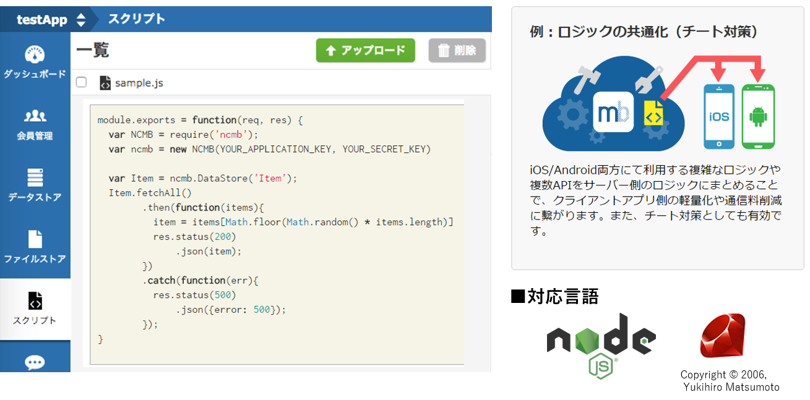]

---

### 概要
* ニフクラ mobile backendの『スクリプト機能』を利用して<br>
__`サーバーレスでルーレットアプリにクーポン機能を実装します`__
* 既にコーディングを完了させたサンプルアプリを使って作業していきます
 * このアプリは完成していますが、今回ポイントとなる「スクリプト」とアプリの連携方法については、実際に皆様が手を動かして体験していただきます

.center[]

* サーバーレスとは?<br> __`サーバーを用意しないで`__ 、アプリのバックエンド機能を実装することです


---
layout: true
class: center, middle, inverse
---
# 2.アプリ作成に使うツール

---
layout: false

### 2.1 Monaca 紹介
* HTML5/JavaScript/CSS3でiOSとAndroidの両OSに対してスマホアプリが開発できる開発環境です  
* クラウド上で開発できます
* __`無料`__ で体験可能です  

.center[]

* MonacaはJavaScriptSDKを利用して連携しています
 * 初めての方でも使いやすい開発環境なので今回のハンズオンに採用しました

---

### 2.2 ニフクラ mobile backend 紹介
* スマートフォンアプリに必要なバックエンド機能が __`開発不要で利用できる`__ クラウドサービスです
* クラウド上に用意された機能を __`APIを呼び出すだけで利用可能`__ です
* __`無料`__ で体験可能です
* APIを利用するためのSDKは幅広く対応 (Swift / iOS / Android / JavaScript / Monaca / Unity)
* mobile Backend as a Service の頭文字を取って、通称 __`mBaaS`__ と呼びます
 * この後 __`ニフクラ mobile backend`__ を __`mBaaS`__ と置き換えてお話しします

.center[]

---
layout: true
class: center, middle, inverse
---
# 3.アカウント準備
---
layout: false

### 3.アカウント準備
* Monacaの利用登録（無料）
<br>https://monaca.mobi/ja/signup
* ニフクラ mobile backend (mBaaS) の利用登録（無料:Basicプラン/SNSID） 
<br> http://mbaas.nifcloud.com/signup.htm
* テキストエディタお持ちでない方はご準備をお願いします
<br>VSCodeはこちらから https://azure.microsoft.com/ja-jp/products/visual-studio-code/
---

layout: true
class: center, middle, inverse
---
# 4.ハンズオンの内容
---
layout: false

### 4.1作成するアプリの内容
ルーレットを回してクーポンを獲得する簡単なデモゲームアプリを作ります

* __`スクリプト機能`__ をはじめとするmBaaSの機能を使って
<br>アプリに __`ルーレット機能`__ を実装します
<br>画面遷移図は以下のようになっています

.center[]

* スクリプト機能の説明をメインで、その他のコードの説明は割愛いたします

---

### 4.2ハンズオンの流れ
.size_large[
- 5 __ハンズオンの準備__
- 5.1【Monaca】アプリ側の準備
- 5.2【mBaaS】サーバー側の準備
- 5.3【Monaca】mBaaSを使うための準備
- 5.4 動作確認①
- 6 __ルーレット機能の作成__
- 6.1  設定ファイルのDL
- 6.2【mBaaS】クーポン画像の準備
- 6.3【mBaaS】データストアにクラスを準備
- 6.4【mBaaS】スーパーユーザーの準備
- 6.5【mBaaS】参照権限の設定
- 6.6【mBaaS】スクリプト準備①SelectReward.js
- 6.7【mBaaS】スクリプト準備②UserPost.js
- 6.8【mBaaS】スクリプト準備③CouponGet.js
- 6.9【Monaca】アプリからスクリプトを呼び出す
- 6.10 動作確認②
- 7 まとめと振り返り
]

---
layout: true
class: center, middle, inverse
---

# 5.ハンズオンの準備

---
layout: false

### 5.1【Monaca】アプリ側の準備
* プロジェクトのインポートとJavaScriptSDKをMonaca側に設定し連携します
 * プロジェクトのインポート
 * SDKの導入
 
.center[]

---

### 5.1【Monaca】アプリ側の準備
* プロジェクトのインポートとJavaScriptSDKをMonaca側に設定し連携します
 * プロジェクトのインポート
 * SDKの導入
 
.center[]

---

### 5.1【Monaca】アプリ側の準備
* Monacaアプリケーションをインポートします
1. Monaca(https://monaca.mobi/ja/signup) にログイン
2. インポートリンク (http://bit.ly/import20191203) をクリック
3. __`インポート`__ をクリック
4. __`MonacaRouletteApp`__ をクリック
5. __`クラウドIDEで開く`__  をクリック

.center[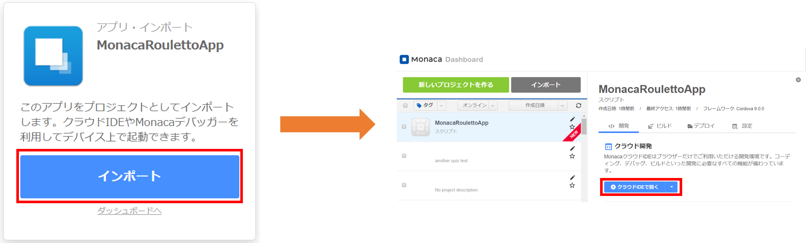]

---

### 5.1【Monaca】アプリ側の準備
* インポートに成功すると以下の画面が表示されます

.center[]

---

### 5.1【Monaca】アプリ側の準備
* SDKの導入（コンポーネントの追加）をします   
  1.メニューバーの __`設定`__ をクリック   
  2.__`JS/CSSコンポーネントの追加と削除`__ をクリック  

.center[]

---

### 5.1【Monaca】アプリ側の準備
* SDKの導入（コンポーネントの追加）をします  
  3.__`コンポーネント名`__ に __`ncmb `__ と入力    
  4.__`検索する`__ をクリック  

.center[]

---

### 5.1【Monaca】アプリ側の準備
* SDKの導入（コンポーネントの追加）をします   
  5.__`ncmb`__ が表示されるので __`追加`__ をクリック  

.center[]

---

### 5.1【Monaca】アプリ側の準備
* SDKの導入（コンポーネントの追加）をします   
  6.バージョンはそのままで、 __`インストール`__ をクリック  

.center[]

---

### 5.1【Monaca】アプリ側の準備
* SDKの導入（コンポーネントの追加）をします   
  7.必ず __`チェックボックスにチェックを入れて`__ 、 __`保存`__  をクリック  

.center[]

---

### 5.1【Monaca】アプリ側の準備
* SDKの導入（コンポーネントの追加）をします   
  8.一覧に __`ncmb`__ が表示ていることを確認  

.center[]

* これでSDKの導入は完了です

---

### 5.2【mBaaS】サーバー側の準備
* mBaaSにもアプリを作成し、払い出されるAPIキーをMonacaに設定    
* SDKの初期化を行うことで連携していきます  

.center[]

---

### 5.2【mBaaS】サーバー側の準備
* mBaaSにもアプリを作成し、払い出されるAPIキーをMonacaに設定   
* SDKの初期化を行うことで連携していきます  

.center[]

---

### 5.2【mBaaS】サーバー側の準備
* mBaaS(https://console.mbaas.nifcloud.com/) にログインします
  * 新しいアプリを作成します
  * アプリ名を __`Roulette`__ と入力
  * 「 __`新規作成`__ 」をクリック

.center[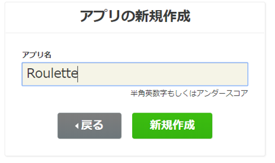]

* mobile backend を既に使用したことがある場合は、画面上方のメニューバーにある「 __`+新しいアプリ`__ 」をクリックすると同じ画面が表示されます

.center[]

---

### 5.2【mBaaS】サーバー側の準備
* アプリ作成が成功すると以下の画像が表示されます

.center[]

* この __`アプリケーションキー`__ と __`クライアントキー`__ を合わせてアプリAPIキーと呼びます
* ここまでで、mBaaS側の連携に必要なものを用意できました

---


### 5.3【Monaca】mBaaSを使うための準備
* 5.2で発行されたAPIキーを設定します
 * __`www/js/app.js`__ を開く
 * 左のファイル一覧より __`▶ www`__ の __`▶`__ をクリック
.center[]

---

### 5.3【Monaca】mBaaSを使うための準備
* 5.2で発行されたAPIキーを設定します
  * 左のファイル一覧より __`▶ js`__ の __`▶`__ をクリック
.center[]

---

### 5.3【Monaca】mBaaSを使うための準備
* 5.2で発行されたAPIキーを設定します
  * 左のファイル一覧より __`app.js`__ をダブルクリック
.center[]

---

### 5.3【Monaca】mBaaSを使うための準備
* 5.2で発行されたAPIキーを設定します
  * 画面に __`app.js`__ が表示されることを確認
.center[]

---

### 5.3【Monaca】mBaaSを使うための準備
* 5.2で発行されたAPIキーを設定します
 * __`APPLICATION_KEY`__ と __`CLIENT_KEY`__ をAPIキー （アプリケーションキーとクライアントキー）に貼り替え
 * メニューバーの __`ファイル`__ > __`保存`__ をクリックしてプロジェクトを保存
  * Windowsでは__`Ctrl + s`__ 、Macは __`Command + s`__ でも保存できる
.center[]
* 入力前
```js
// 【NCMB】SDKの初期化
var ncmb = new NCMB("APPLICATION_KEY", "CLIENT_KEY");
```
* 入力後
```js
// 【NCMB】SDKの初期化
var ncmb = new NCMB("7612fe7----------------", "5a2efeb----------------");
```
 
---

### 5.3【Monaca】mBaaSを使うための準備
* 設定完了後は以下の画像のようになります

.center[]

* ここまでで、__`SDKの初期化`__ が完了しMonacaとmBaaSの連携が出来ました

---

### 5.4 動作確認① (会員管理)
* ここでログイン処理が正しく行われることでMonacaとmBaaSが連携できたことを確認していきます

.center[]

---
### 5.4 動作確認① (新規登録処理)
* Monacaのプレビュー画面で動作確認をしましょう
* プレビュー画面は赤枠部分です

.center[]


---
### 5.4 動作確認① (新規登録処理)
* __`新規会員登録`__ をします
 * __`ユーザー名`__ 、__`パスワード`__ を好きな文字で入力
 * __`新規会員登録`__ をクリック
 
.center[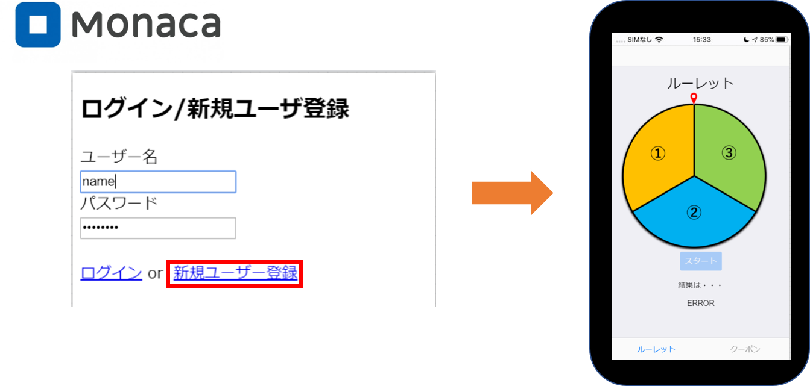]

---

### 5.4 動作確認① (新規登録処理)
* __`新規会員登録`__ をします
 * ログイン処理後、表示されるルーレット画面では以下のようにErrorが出てきますが、ここではそのままで大丈夫です

.center[]

---

### 5.4 動作確認① (新規登録処理)
* __`新規会員登録`__ をします
 * mBaaSの管理画面を開く
 * __`会員管理`__ をクリック

.center[]

---

### 5.4 動作確認① (新規登録処理)
* __`新規会員登録`__ をします
 * 新規登録に成功していると会員情報が追加、ルーレット画面が表示されます
 * __`Password`__ はセキュリティ上 __`hidden`__ となっています

.center[]

---

layout: true
class: center, middle, inverse

---

# 6.ルーレット機能の作成

---
layout: false

### 6.1 設定ファイルのDL
* ファイルストアとスクリプトに今回使用するデータを用意します
 * 設定ファイルをダウンロード(http://bit.ly/download20191203)
* ファイル構成は以下の通りです

.center[]

---

### 6.2【mBaaS】クーポン画像の準備
* ファイルストアに今回使用するデータアップロードしていきます

.center[]

---

### 6.2【mBaaS】クーポン画像の準備
* ファイルをアップロードします  
 1. ファイルストアをクリック  
 2. アップロードをクリック  
 3. 6.1でダウンロードしたimgフォルダの画像ファイルを点線内に __`ドラッグ＆ドロップ`__ または __`ファイルを選択`__ をクリックして指定  
 4. __`アップロードする`__ をクリック  

.center[]

---

### 6.2【mBaaS】クーポン画像の準備
* アップロードに成功すると以下のように表示されます

.center[]

* 表示されない場合は __`更新ボタン`__ をクリックすると確認できます

---

### 6.3【mBaaS】データストアにクラスを準備する手順
* データストアにクーポン画像や、確率、賞の値を持たせたクラス「Item」を準備します
 
.center[]

---


### 6.3【mBaaS】データストアにクラスを準備する手順
* データストアに「Item」クラスを準備します  
  1.__`データストア`__ をクリック  
  2.__`作成`__ をクリック  
  3.__`新規作成`__ をクリック  
  4.クラス名に __`Item`__ と入力  
  5.__`作成する`__ をクリック  
 
.center[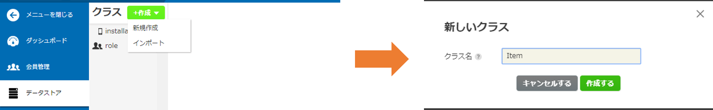]

---


### 6.3【mBaaS】データストアにクラスを準備する手順
* データストアに「Item」クラスを準備します  
  6.__`新しいフィールド`__ をクリック  
  7.フィールド名に __`rate`__ と入力  
  8.__`作成する`__ をクリック  
  9.この手順で、フィールド名 __`rewards`__ と __`png`__ も作成  

.center[]

---

### 6.3【mBaaS】データストアにクラスを準備する手順
* 3つのフィールドの作成に成功すると以下のように表示されます
* それぞれフィールドには以下の値を格納します
 * rate: 確率
 * rewards: 賞の値
 * png: ファイルストアの画像名
 
.center[]

---

### 6.3【mBaaS】データストアにクラスを準備する手順
* フィールドに値を用意します 
  1. __`新しいレコード`__ をクリック  
  2. __`png`__ フィールドの　__`(undefined)`__ をダブルクリックし配列値 __`["one.png","two.png","three.png"] `__ を入力  
  3. 下に出てくるポップアップの __`文字列▼ `__ をクリックし __`配列`__ に変更し  __`Enter`__  を押下  
  4. 上記の手順と同様に、 __`rate`__ には __`[0.2,0.3]`__ 、rewardsには __`[1,2,3]`__ を入力 
  
.center[]

---

### 6.3【mBaaS】データストアにクラスを準備する手順
* 登録が上手くいくと以下のように表示されます。
 
.center[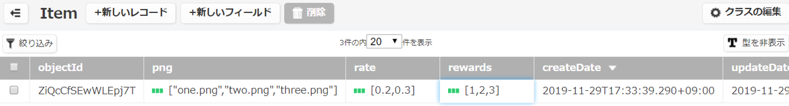]


* 配列アイコン(緑の3本線)がない場合、右端の「型を表示」ボタンを押すと表示されます

.center[]

---

### 6.3【mBaaS】データストアにクラスを準備する手順
* データストアに当たった賞のユーザー名が登録されるクラス「Reward1」、「Reward2」、「Reward3」を準備します
 
.center[]

---

### 6.3【mBaaS】データストアにクラスを準備する手順
* データストアに「Reward1」、「Reward2」、「Reward3」クラスを準備します 
  1. __`データストア`__ をクリック  
  2. __`作成`__ をクリック  
  3. __`新規作成`__ をクリック  
  4. クラス名に __`Reward1`__ と入力  
  5. __`作成する`__ をクリック  
  6. 上記手順で同様に __`Reward2`__ と __`Reward3`__ も作成  
  
.center[]

---

### 6.3【mBaaS】データストアにクラスを準備する手順
* 作成に成功すると以下のように表示されます
 
.center[]

---

### 6.4【mBaaS】スーパーユーザーの準備
* スーパーユーザーの役割
 * セキュリティを担保するために、特定のユーザーだけがアクセスできるようにaclを設定し、工夫しています

.center[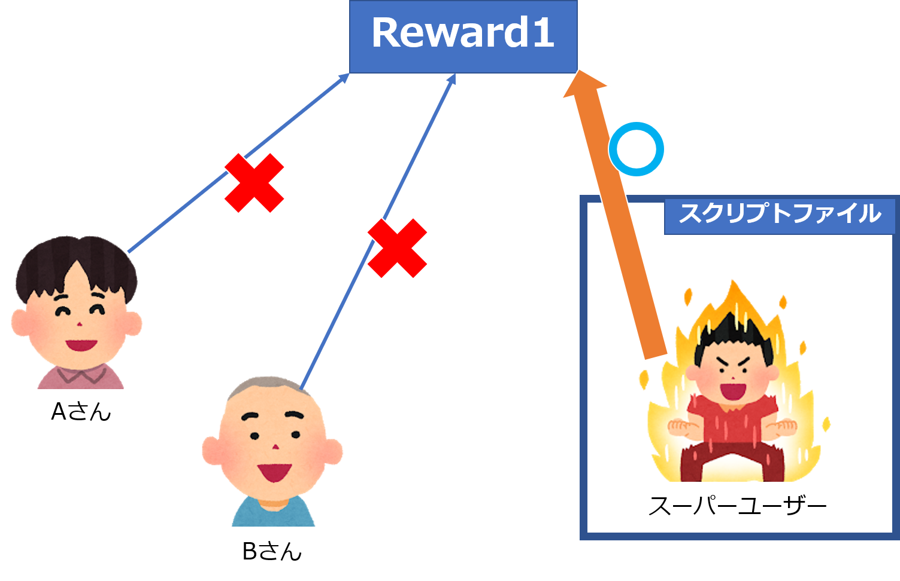]

---

### 6.4【mBaaS】スーパーユーザーの準備
* Rewardクラスへのアクセス権限を持ったスーパーユーザーを用意します
 * スーパーユーザーだけがアクセスできるacl設定を施します

.center[]

---

### 6.4【mBaaS】スーパーユーザーの準備
* Rewardクラスへのアクセス権限を持ったスーパーユーザーを用意します
 * スーパーユーザーだけがアクセスできるacl設定を施します
 
.center[]

---

### 6.4【mBaaS】スーパーユーザーの準備
* Rewardクラスへのアクセス権限を持ったスーパーユーザーを用意します
 * スーパーユーザーだけがアクセスできるacl設定を施します

.center[]

---

### 6.4【mBaaS】スーパーユーザーの準備
* スーパーユーザーを用意する  
  1.__`データストア`__ をクリック  
  2.__`新しい会員`__ をクリック  
  3.__`新しい会員の新規作成`__ をクリック  
  4.入力欄が表示されることを確認  

.center[]

---

### 6.4【mBaaS】スーパーユーザーの準備
* スーパーユーザーを用意する  
  5. __`userName`__ に __`superuser`__ と入力し Enterを押下  
  6. __`password`__ に __`super`__ と入力し Enterを押下  

.center[]
* 成功するとユーザーが追加され、__`password`__ が __`hidden`__ になります  
* __`objectId`__ が自動で割り振られ、この値をacl設定に後ほど使用します
  * __`objectId`__ : mBaaSのデータ1つ1つに払い出された、機能ごとに重複しないことになっているID

---

### 6.5【mBaaS】参照権限の設定
* 「Reward1」、「Reward2」、「Reward3」のクラスに参照権限を設定します
* __`パーミッション`__ の設定をします  
  1.__`会員管理`__ をクリック  
  2.__`superuser`__ の __`objectId`__ をコピー  

.center[]

---

### 6.5【mBaaS】参照権限の設定
* __`パーミッション`__ の設定をします  
  3.__`データストア`__ をクリック  
  4.__`Reward1`__ をクリック  
  5.__`クラスの編集`__ をクリック  
  6.__`パーミッションの設定`__ をクリック  

.center[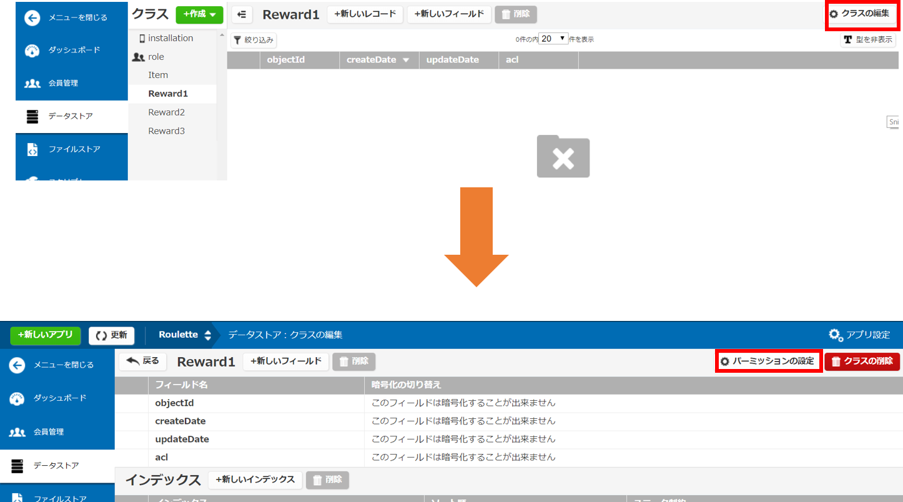]

---

### 6.5【mBaaS】参照権限の設定
* __`パーミッション`__ の設定をします  
  7.__`新しいパーミッション`__ をクリック  
  8.__`全員 ▼`__ をクリック  
  9.__`会員`__ を選択  
  10.先ほどコピーした __`objectId`__ をペースト  
  11.__`変更を保存`__ をクリック  

.center[]

---

### 6.5【mBaaS】参照権限の設定
* __`パーミッション`__ の保存が成功すると緑のポップアップが右上に表示される
.center[]
* 設定されているか確認します  
  1.__`データストア`__ をクリック  
  2.__`パーミッションの設定`__ をクリック  
* 登録されると次のように表示されます  
.center[]
* 同じ手順を __`Reward2`__ 、 __`Reward3`__ に対しても権限を設定する


---


### 6.6【mBaaS】スクリプト準備①SelectReward.js
* 処理内容
  1. Itemからルーレットの確率を取得
  2. その確率から1等,2等,3等を算出
  3. 当たった賞の値をItemから取得しMonaca側へ返す
* Point
  * 確率の調整が可能
  * 1等が絶対に当たらない鬼畜設定も可能…

.center[]

---

### 6.6【mBaaS】スクリプト準備①SelectReward.js
* 処理内容
  1. Itemからルーレットの確率を取得
  2. その確率から1等,2等,3等を算出
  3. 当たった賞の値をItemから取得しMonaca側へ返す

.center[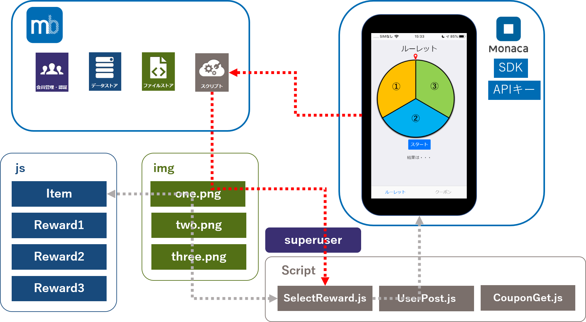]

---

### 6.6【mBaaS】スクリプト準備①SelectReward.js
* 処理内容
  1. Itemからルーレットの確率を取得
  2. その確率から1等,2等,3等を算出
  3. 当たった賞の値をItemから取得しMonaca側へ返す

.center[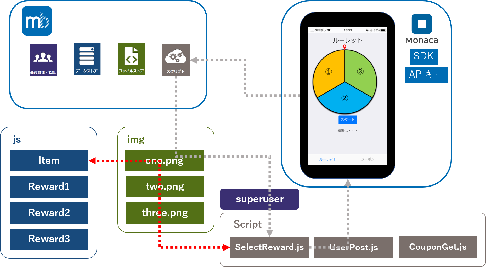]

---

### 6.6【mBaaS】スクリプト準備①SelectReward.js
* 処理内容
  1. Itemからルーレットの確率を取得
  2. その確率から1等,2等,3等を算出
  3. 当たった賞の値をItemから取得しMonaca側へ返す

.center[]

---

### 6.6【mBaaS】スクリプト準備①SelectReward.js
* コード確認

.size_small_7[
```js
module.exports = function (req, res) {
    var name = req.query.user;
    
    // 【NCMB】SDKインポート
    var NCMB = require("ncmb");
    
    // 【NCMB】SDKの初期化
    var ncmb = new NCMB("APPLICATION_KEY", "CLIENT_KEY"); 
}
```
]

* module.exports : Scriptを書くときに必要な宣言 
* require('ncmb') : SDKをインポート
* new NCMB("APPLICATION_KEY", "CLIENT_KEY") ：SDKを初期化

---

### 6.6【mBaaS】スクリプト準備①SelectReward.js
* コード確認

.size_small_7[
```js
/* 【NCMB】データストアから確率を取得する */
    // 保存先クラスの指定
    var Item = ncmb.DataStore("Item");
    // 全件取得
    Item.fetchAll()
        .then(function (results) {
            /* 取得成功時の処理 */
            // 確率によりクーポンを決定
            var rewardNum = selectReward(results[0].rate);
            // データに不備があった場合の処理
            if (rewardNum == -1) {
                res.status(500).json({
                    "message": "Probabilities of rewards must be defined as Array(length=2)"
                });
            }
            // クーポン番号と画像情報を返却
            var stopNumber = results[0].rewards[rewardNum];
            var png = results[0].png[rewardNum];
            res.status(200).json({stopNumber,png});
        })
        .catch(function (error) {
            /* 取得失敗時の処理 */
            res.status(500).send("Error: " + error);
        });
```
]

* Item.fetchAll() :Itemクラスにて全件取得
* res.status(status) :statusをアプリ側へ返す
* res.send(data)	:dataをアプリ側へ返す
* res.json(data)	:dataをjson形式にしてアプリ側へ返す

---

### 6.6【mBaaS】スクリプト準備①SelectReward.js
* コード確認

.size_small_7[
```js
// クーポンの決定処理
function selectReward(probabilities) {
    // probabilitiesが配列かどうか確認
    if (!(Array.isArray(probabilities))) return -1;
    
    // probabilities の要素数の確認
    if (probabilities.length != 2) return -1;
    
    const p0 = Number(probabilities[0]); // rewards[0]が選択される確率
    const p1 = Number(probabilities[1]); // rewards[1]が選択される確率
    
    // 乱数の生成
    var randNum = Math.random();
    // クーポンの決定
    if (randNum <= p0) return 0;
    else if (randNum <= p0 + p1) return 1;
    else return 2;
}
```
]

* 何等賞が当たったかを算出して、1,2,3のどれかをreturnしている関数

---

### 6.6【mBaaS】スクリプト準備①SelectReward.js
* 3行目のAPIキーを置き換えます  
  1.editorにてSelectReward.jsを開く  
  2.APPLICATION_KEYとCLIENT_KEYを自分のAPIキーに置き換え  
  3.各editorにて保存
  
```js
    var ncmb = new NCMB('APPLICATION_KEY', 'CLIENT_KEY');
```
---

### 6.6【mBaaS】スクリプト準備①SelectReward.js
* SelectReward.jsをアップロードする  
  1.__`スクリプト`__ をクリック  
  2.__`アップロード`__ をクリック  

.center[]
 
---

### 6.6【mBaaS】スクリプト準備①SelectReward.js
* SelectReward.jsをアップロードする  
  3.SelectReward.jsを __`ドラッグ＆ドロップ`__  か __`ファイル選択`__   
  4.メソッドは __`GET`__ を選択  
  5.ファイルの状態は__`実行可能`__ を選択  
  6.__`アップロードする`__ をクリック  
  
.center[]
 
---

### 6.6【mBaaS】スクリプト準備①SelectReward.js
* SelectReward.jsをテストしてみましょう  
  7.SelectReward.jsがアップロードされていることを確認  
  8.SelectReward.jsをクリック  
  9.__`実行タブ`__ をクリック  
  10.__`実行`__ をクリック  
  
.center[]
 
---

### 6.6【mBaaS】スクリプト準備①SelectReward.js
* SelectReward.jsをテストしてみましょう  
  11.以下の警告が出るが __`実行する`__ をクリック   
.center[]
  12.実行ボタンの下に結果が出力されていることを確認  
  13.当たった等(stopNumber)とクーポン画像名(png)が取れている  
.center[]
 * ここでDBの入力値などの間違いが出てくる
 
---

### 6.7【mBaaS】スクリプト準備②UserPost.js
* 処理内容  
  1. Monaca側から当たった賞をqueryより取得  
  2. 管理者でログイン  
  3. 当たった賞のログにユーザーの名前があるか検索  
  4. 無ければ登録する(クーポンを表示できるようになる)  
* Point
  * 管理者でしか登録できないため、セキュリティ面も安心
  * 悪意のあるユーザーが勝手に登録すること防ぐ

.center[]

---

### 6.7【mBaaS】スクリプト準備②UserPost.js
* 処理内容  
  1. Monaca側から当たった賞をqueryより取得  
  2. 管理者でログイン  
  3. 当たった賞のログにユーザーの名前があるか検索  
  4. 無ければ登録する(クーポンを表示できるようになる)  

.center[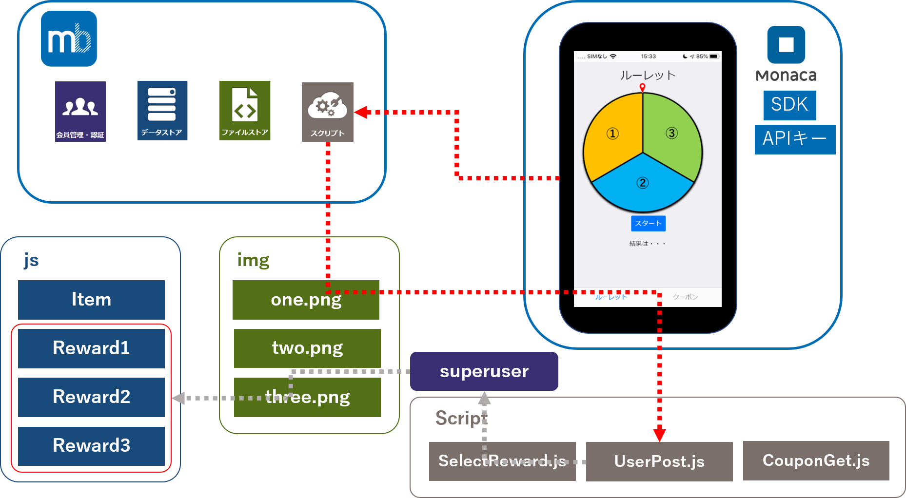]

---

### 6.7【mBaaS】スクリプト準備②UserPost.js
* 処理内容  
  1. Monaca側から当たった賞をqueryより取得  
  2. 管理者でログイン  
  3. 当たった賞のログにユーザーの名前があるか検索  
  4. 無ければ登録する(クーポンを表示できるようになる)  

.center[]

---

### 6.7【mBaaS】スクリプト準備②UserPost.js
* 処理内容  
  1. Monaca側から当たった賞をqueryより取得  
  2. 管理者でログイン  
  3. 当たった賞のログにユーザーの名前があるか検索  
  4. 無ければ登録する(クーポンを表示できるようになる)  

.center[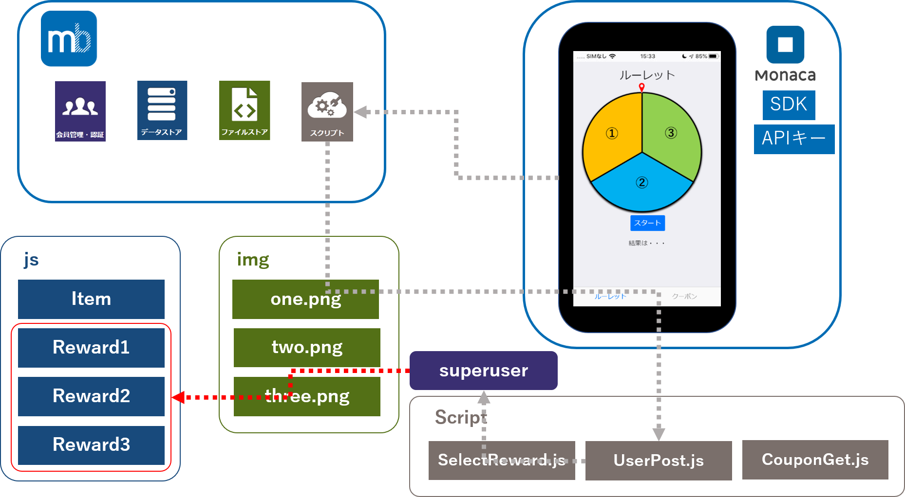]

---

### 6.7【mBaaS】スクリプト準備②UserPost.js
* コード確認

.size_small_7[
```js
module.exports = function (req, res) {
    var name = String(req.query.user);
    var stopNumber = req.query.stopNumber;
    var className = "Reward" + String(stopNumber);
    
    // 【NCMB】SDKインポート
    var NCMB = require("ncmb");
    // 【NCMB】SDKの初期化
    var ncmb = new NCMB("APPLICATION_KEY", "CLIENT_KEY");
```
]

* req.query.*** :アプリ側からquery指定で受けっとった値
* module.exports :p70を参考
* require('ncmb') :p70を参考

---

### 6.7【mBaaS】スクリプト準備②UserPost.js
* コード確認

.size_small_7[
```js
    // 【NCMB】あらかじめ準備したsuperuserユーザーでログイン
    ncmb.User.login("superuser", "super")
        .then(function (superuser) {
            /* ログイン成功時の処理 */
        })
        .catch(function (err) {
            /* ログイン失敗時の処理 */
            res.status(500).send("Error: " + error);
        });
```
]

* ncmb.User.login("superuser", "super"): 6.4,6.5章で用意したスーパーユーザーでログイン
 * スーパーユーザーでログインしないと、この後の検索や登録処理が出来ない

---

### 6.7【mBaaS】スクリプト準備②UserPost.js
* コード確認

.size_small_7[
```js
// 【NCMB】ルーレットの結果毎にユーザー名を保存する
// 保存先クラスの生成
var Reward = ncmb.DataStore(className);
// 一致する情報を取得する
Reward.equalTo("name", name)
        .fetchAll()
        .then(function(results) {
            /* 取得成功時の処理 */
            var objectId = "";
            if (results[0]==="" || results[0]===undefined) {
                objectId = "";
            }else{
                objectId = results[0].objectId;
            }
        })
        .catch(function (error) {
            /* 取得失敗時の処理 */
            res.status(500).send("Error: " + error);
        });  
}
```
]

* Reward.equalTo("name", name) :今回の場合だと nameが一致しているかを判断
* .fetchAll() :p71参照
* res.status(status) :p71参照

---

### 6.7【mBaaS】スクリプト準備②UserPost.js
* コード確認

.size_small_7[
```js
// 新規登録または更新をする
var nameAdd = new Reward();
nameAdd.set("name", name)
    .save() 
    .then(function (nameAdd) {
        nameAdd.set("name", name);
        return nameAdd.update();
    })
    .then(function (success) {
        /* 保存または更新成功時の処理 */
        res.send("POST data successfully!");   
    })
    .catch(function (error) {
        /* 保存または更新失敗時の処理 */
        res.status(500).send("Error: " + error);
    });
```
]

* .set()：条件をセットする
* .save() ：.set()した値を保存する
* .update()：.set()した値でフィールドの値を更新する

---


### 6.7【mBaaS】スクリプト準備②UserPost.js
* 3行目のAPIキーの置き換え  
  1.editorにてUserPost.jsを開く  
  2.APPLICATION_KEYとCLIENT_KEYを自分のAPIキーに置き換え  
  3.各editorにて保存  
  
```js
    var ncmb = new NCMB('APPLICATION_KEY', 'CLIENT_KEY');
```
---

### 6.7【mBaaS】スクリプト準備②UserPost.js
* UserPost.jsをアップロードする  
  1.UserPost.jsをを __`ドラッグ＆ドロップ`__  か __`ファイル選択`__ 
  2.メソッドは __`POST`__ を選択  
  3.ファイルの状態は __`実行可能`__ を選択  
  4.__`アップロードする`__ をクリック  

.center[]
 
---

### 6.7【mBaaS】スクリプト準備②UserPost.js
* UserPost.jsをテストしてみましょう  
  5.UserPost.jsがアップロードされていることを確認  
  6.UserPost.jsをクリック  
  7.__`実行タブ`__ をクリック  
  8.queryの欄に __`user=name&stopNumber=1`__ を入力(nameは好きな文字、stopNumberは1,2,3のどれかを指定)  
  9.__`実行`__ をクリック  
  
.center[]
 
---

### 6.7【mBaaS】スクリプト準備②UserPost.js
* UserPost.jsのテストをしてみましょう  
  10.以下の警告が出るが__`実行する`__ をクリック  
.center[]
* UserPost.jsを実行  
  11.実行ボタンの下に結果が出力されていることを確認  
.center[]
* __`POST data successfully!`__ と出力されていれば成功です

---

### 6.7【mBaaS】スクリプト準備②UserPost.js
* UserPost.jsのテストをしてみましょう  
  13.__`データストア`__ をクリック  
  14.今回はstopNumberを1としたので __`Reward1`__ をクリック  
.center[]
* 指定したuserが登録されていれば成功です  
 
---

### 6.8【mBaaS】スクリプト準備③CouponGet.js
* 処理内容  
  1. 非同期処理スタート、まずは管理者でログイン  
  2. 次にReward1にユーザーがいるか検索  
  3. 存在していれば画像名をItemから取得  
  4. 2,3が終了後Reward2,Reward3と順に同様処理が行われる  
* Point  
  * 同期処理を使用   
  * 処理が重ならずに全ての処理の終了後に値が返される  
.center[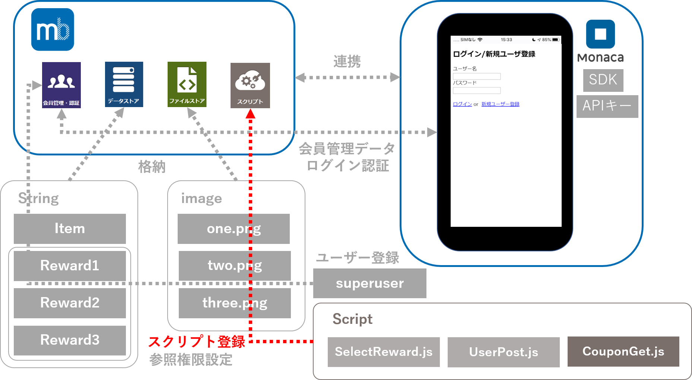]
 
---

### 6.8【mBaaS】スクリプト準備③CouponGet.js
* 処理内容  
  1. 非同期処理スタート、まずは管理者でログイン  
  2. 次にReward1にユーザーがいるか検索  
  3. 存在していれば画像名をItemから取得  
  4. 2,3が終了後Reward2,Reward3と順に同様処理が行われる  

.center[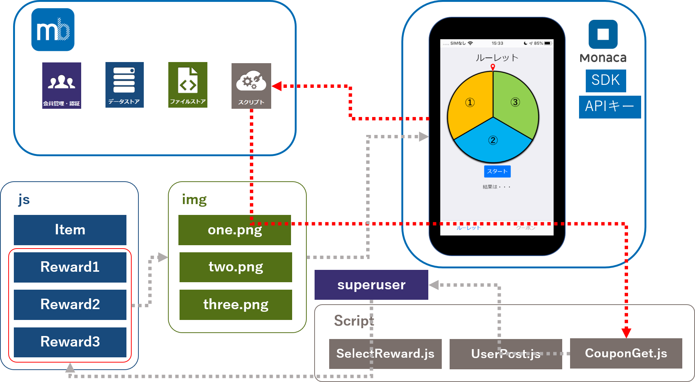]
 
---

### 6.8【mBaaS】スクリプト準備③CouponGet.js
* 処理内容  
  1. 非同期処理スタート、まずは管理者でログイン  
  2. 次にReward1にユーザーがいるか検索  
  3. 存在していれば画像名をItemから取得  
  4. 2,3が終了後Reward2,Reward3と順に同様処理が行われる  

.center[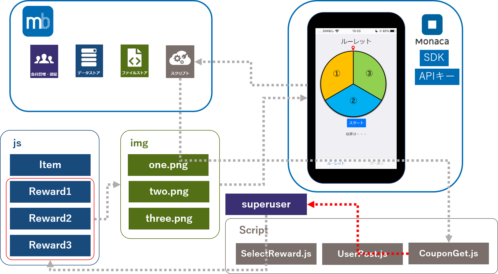]
 
---

### 6.8【mBaaS】スクリプト準備③CouponGet.js
* 処理内容  
  1. 非同期処理スタート、まずは管理者でログイン  
  2. 次にReward1にユーザーがいるか検索  
  3. 存在していれば画像名をItemから取得  
  4. 2,3が終了後Reward2,Reward3と順に同様処理が行われる  

.center[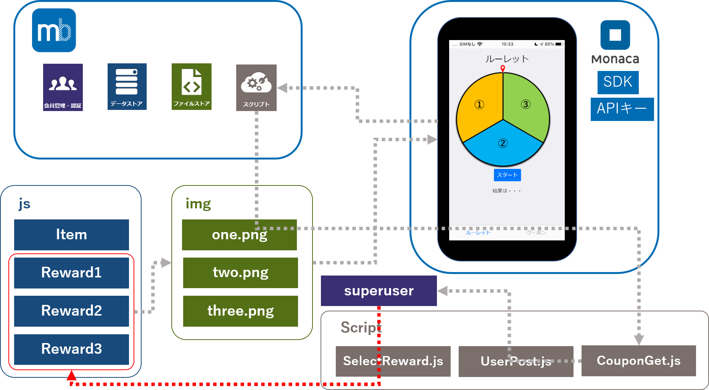]
 
---

### 6.8【mBaaS】スクリプト準備③CouponGet.js
* 処理内容  
  1. 非同期処理スタート、まずは管理者でログイン  
  2. 次にReward1にユーザーがいるか検索  
  3. 存在していれば画像名をItemから取得  
  4. 2,3が終了後Reward2,Reward3と順に同様処理が行われる  

.center[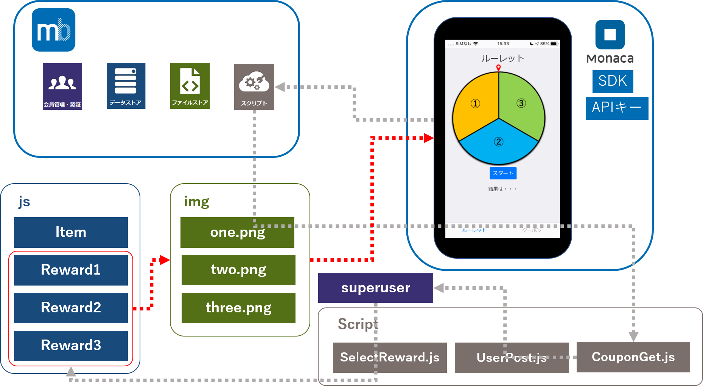]
 
---

### 6.8【mBaaS】スクリプト準備③CouponGet.js
* コード確認

.size_small_7[
```js
module.exports = function (req, res) {
    var name = req.query.user;
    var png1;
    var png2;
    var png3;
    
    // 【NCMB】SDKインポート
    var NCMB = require("ncmb");
    // 【NCMB】SDKの初期化
    var ncmb = new NCMB("APPLICATION_KEY", "CLIENT_KEY");
    
    // 【NCMB】各種保存先クラスの生成
    var Item = ncmb.DataStore("Roulette_Item");
    var Reward1 = ncmb.DataStore("Reward1");
    var Reward2 = ncmb.DataStore("Reward2");
    var Reward3 = ncmb.DataStore("Reward3"); 
}
```
]

* module.exports : p70参照
* require('ncmb') : p70参照

---

### 6.8【mBaaS】スクリプト準備③CouponGet.js
* コード確認

.size_small_7[
```js
// 【NCMB】あらかじめ準備したsuperuserユーザーでログイン
    const promise = new Promise((resolve, reject) => {
        ncmb.User.login("superuser", "super")
            .then(function (superuser) {
                /* ログイン成功時の処理 */
            })    
            .catch(function (error) {
                res.status(500).send("Error: " + error);
            });
    });
    
    promise.then(() => setTimeout(function () {
        res.status(200).json({png1,png2,png3});
    }, 1000));
}
```
]

* ncmb.User.login("superuser", "super") : p83参照
* res.status(status) : statusをアプリ側へ返す

---

### 6.8【mBaaS】スクリプト準備③CouponGet.js
* コード確認

.size_small_7[
```js
Reward1.equalTo("name", name)
    .fetchAll()
    .then(function (reward1) {
        if(reward1[0]==="" || reward1[0]===undefined){
            png1 = "";
        }else{
            // 【NCMB】Roulette_Itemクラスを全件検索する
            Item.fetchAll()
                .then(function (result1) {
                    png1 = result1[0].png[0];
                })
                .catch(function (error) {
                    res.status(500).json({error: 500});
                });
        }
    })
    .catch(function (error) {
        res.status(500).send("Error: " + error);
    });
    
    // 以下Reward2,Reward3クラスも同様に

}
```
]

* Reward1.equalTo("name", name).fetchAll() : p71,p84参照

---

### 6.8【mBaaS】スクリプト準備③CouponGet.js
* 3行目のAPIキーの置き換え  
 1.editorにてCouponGet.jsを開きます  
 2.APPLICATION_KEYとCLIENT_KEYを自分のAPIキーに置き換えします  
 3.各editorにて保存を実施する  
 
```js
    var ncmb = new NCMB('APPLICATION_KEY', 'CLIENT_KEY');
```
---

### 6.8【mBaaS】スクリプト準備③CouponGet.js
* CouponGet.jsをアップロードする  
  1.CouponGet.jsを __`ドラッグ＆ドロップ`__ か __`ファイル選択`__  
  2.メソッドは__`Get`__ を選択  
  3.ファイルの状態は__`実行可能`__ を選択  
  4.__`アップロードする`__ をクリック  
  
.center[]
 
---

### 6.8【mBaaS】スクリプト準備③CouponGet.js
* CouponGet.jsをテストしてみましょう  
  5.CouponGet.jsがアップロードされていることを確認  
  6.CouponGet.jsをクリック  
  7.__`実行タブ`__ をクリック  
  8.queryの欄に __`user=name`__ を入力(nameは好きな文字列)  
  9.__`実行`__ をクリック  
  
.center[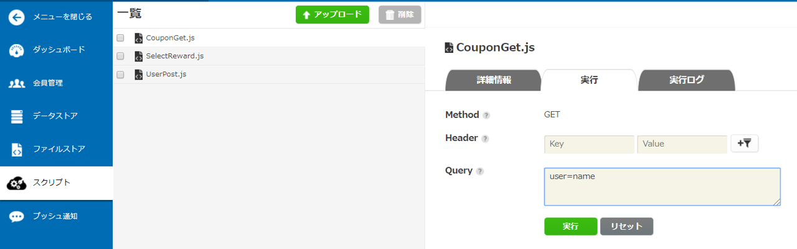]
 
---

### 6.8【mBaaS】スクリプト準備③CouponGet.js
* CouponGet.jsをテストしてみましょう  
  10.以下の警告が出るが __`実行する`__ をクリック  
.center[]  
  11.実行ボタンの下に結果が出力されていることを確認  
.center[]  
* 現在はReward1のクラスなのでone.pngが結果として取得できている

---

### 6.9【Monaca】アプリからスクリプトを呼び出す
* 管理画面上で動作確認（実行してただしくログがでるか）の手順  
  1. app.jsを開きCtrl + F にて検索窓で「//MARK」と検索  
  2. Mark内を大きく①、②、③に分けています  
  3. スクリプト①にてSelectReward.js  
  <br>スクリプト②にてUserPost.js  
  <br>スクリプト③にてCouponGet.jsが呼ばれています  

---

### 6.9【Monaca】アプリからスクリプトを呼び出す ①
* SelectReward.js呼び出しコード確認  
  * 非同期処理にてスクリプトを呼び出し  
  * GETメソッドを使用  

.size_small_7[
```js
const promise = new Promise((resolve, reject) => {
        //MARK: 【NCMB】スクリプト①：ルーレットの当たりを取得
        ncmb.Script.exec("GET", "SelectReward.js")
            .then(function (res) {
                /* スクリプトの実行成功時の処理 */
                resolve();
            })
            .catch(function (err) {
                /* スクリプトの実行失敗時の処理 */
            });
    });
    promise.then(() => setTimeout(function () {
```
]

---

### 6.9【Monaca】アプリからスクリプトを呼び出す ②
* UserPost.js呼び出しコード確認  
  * queryを指定して実行  
  * POSTメソッドを使用  

.size_small_7[
```js
ncmb.Script.query({"user": user.userName,"stopNumber": stopNumber})
                .exec("POST", "UserPost.js")
                .then(function (res) {
                    /* スクリプトの実行成功時の処理 */
                })
                .catch(function (err) {
                    /* スクリプトの実行失敗時の処理 */
                });
```
]

---

### 6.9【Monaca】アプリからスクリプトを呼び出す ③
* CouponGet.js呼び出しコード確認  
  * 非同期処理にてスクリプトを呼び出し  
  * GETメソッドを使用  
  * queryを指定して実行  

.size_small_7[
```js
const promise = new Promise((resolve, reject) => {
        //MARK: 【NCMB】スクリプト③：当たったクーポン画像を取得
        ncmb.Script.query({"user": user.userName})
            .exec("GET", "CouponGet.js")
            .then(function (res) {
                /* スクリプトの実行成功時の処理 */
                resolve();
            })
            .catch(function (err) {
                /* スクリプトの実行失敗時の処理 */
            });
    });
    // クーポンページの画像をロードする
    promise.then(() => setTimeout(function () {
}
```
]

---

### 6.10【動作確認】
* 管理画面上で動作確認（実行してただしくログがでるか）の手順  
  1.好きなユーザー名と、パスワードを入力し __`新規ログイン`__  

.center[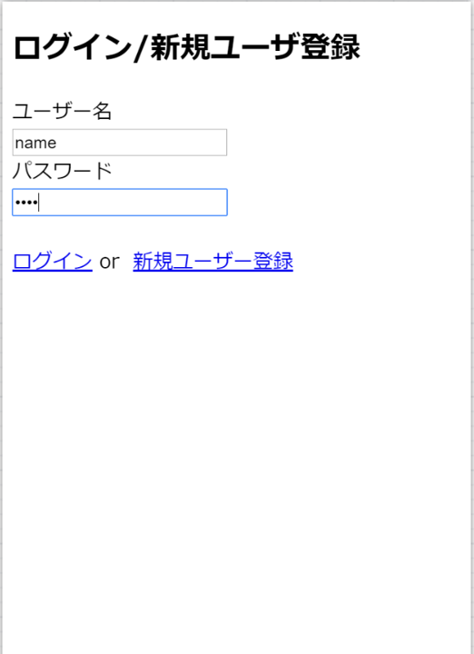]

---

### 6.10【動作確認】
* 管理画面上で動作確認（実行してただしくログがでるか）の手順  
  2.正常にログインできると、このルーレット画面に遷移  
  3.__`スタートボタン`__ を押してルーレット開始  

.center[]

---

### 6.10【動作確認】
* 管理画面上で動作確認（実行してただしくログがでるか）の手順  
  4.ルーレット回転(この時回転までに数秒の間があります)  
  5.ルーレット停止すると結果を表示  

.center[]

---

### 6.10【動作確認】
* 管理画面上で動作確認（実行してただしくログがでるか）の手順  
  6.クーポンページに遷移  
  7.__`Reload`__ ボタンを押す  
  8.当たったクーポンが表示される  
  
.center[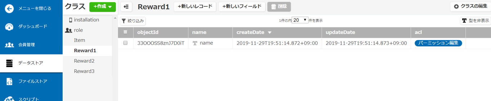]

---

layout: true
class: center, middle, inverse
---
# 7.まとめと振り返り

---
layout: false

### まとめと振り返り
お疲れさまでした。  
  
スクリプト機能の基本的な使い方や、メリットについて理解いただけたのではないかと思います。  
  
以下の公式ホームページにもスクリプトの基本的な使い方についての説明が掲載されていますので、復習の意味を込めてお時間のある時に見返していただけたらと思います。導入は他の機能に比べて敷居は高いかもしれませんが、セキュリティの向上をするうえでは必須の機能でもあります。自分なりにスクリプト機能を使うことを主としたアプリ開発をしてみると面白いかもしれません。  
  
今後ともニフクラ mobile backendをどうぞよろしくお願いいたします。   
  
スクリプト（Monaca）基本的な使い方(https://mbaas.nifcloud.com/doc/current/script/basic_usage_monaca.html)  
